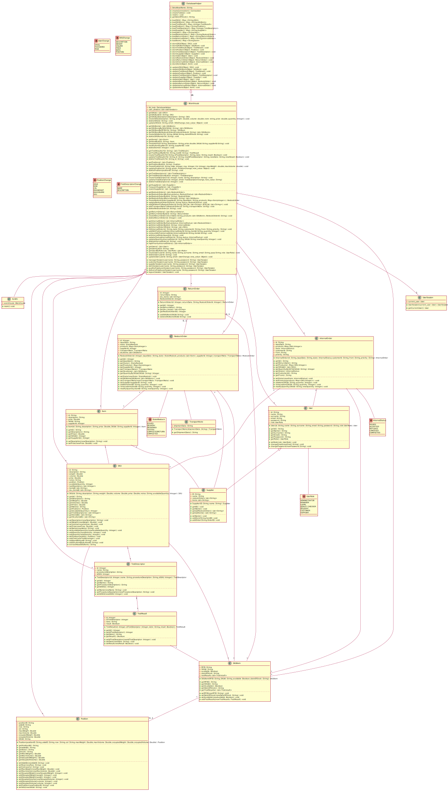

# Design Document 

Authors: Team 48

Date: 23/04/2022

Version: 0.1


# Contents

- [High level design](#package-diagram)
- [Low level design](#class-diagram)
- [Verification traceability matrix](#verification-traceability-matrix)
- [Verification sequence diagrams](#verification-sequence-diagrams)


# Instructions

The design must satisfy the Official Requirements document, notably functional and non functional requirements, and be consistent with the APIs


# High level design

The architectural pattern selected is the client - server model. Clients can be smartphones, tablets, PCs.

The choice is to avoid any development client side. The clients will access the server only through a browser, using a device.

The server has two components:
- The frontend: is developed with web technologies (JavaScript, HTML, Css) and is in charge of collecting user inputs to send requests to the backend;
- The backend: is developed using node.js, exposes API to the front-end.

Together, they implement a layered style: Presentation layer (front end), Application logic and data layer (back end).

Together, they implement also an MVC pattern, with the V on the front end and the MC on the back end.

## Front End

The Frontend component is made of:
- Views: the package contains the .html pages that are rendered on the browser and that provide the GUI to the user.
- Styles: the package contains .css style sheets that are used to render the GUI. We could also use Bootstrap Framework.
- Controller: the package contains the JavaScript files that catch the user's inputs. Based on the user's inputs and on the status of the GUI widgets, the JavaScript controller creates REST API calls that are sent to the Controller implemented in the back-end.

## Back End

The backend  uses a MC style, combined with a layered style (application logic, data).

The back end is implemented using node.js developing applications.
- Data: the package is used for managing and processing data (implementing the main "Model" part of the MVC architectural pattern);
- Controller: this package is in charge of handling the calls to the REST API that are generated by the user's interaction with the GUI. The Controller package contains methods in 1:1 correspondance to the REST API calls.


# Low level design



<details>
    <summary>Show Source</summary>

```
class EzWh {
    - warehouse : Warehouse
    __
    + main(): void
}

enum UserChange {
    EMAIL
    PASSWORD
    ROLE
}

enum SKUChange {
    DESCRIPTION
    WEIGHT
    VOLUME
    PRICE
    NOTE
    POSITION
}

enum PositionChange {
    AISLE
    ROW
    COL
    MAXWEIGHT
    MAXVOLUME
    SKU
}

enum TestDescriptorChange {
    NAME
    DESCRIPTION
}

class Warehouse {
    - db_help : DatabaseHelper
    - user_sessions : List<UserSession>
    __
    + getSKUs() : List<SKU>
    + getSKUbyId(id : String) : SKU
    + getSKUbyDescription(Description : String) : SKU
    + createSKU(description : String, weight : double, volume : double, note : string, price : double, quantity : Integer) : void
    + deleteSKU(id : String) : void
    + updateSKU(id : String, which : SKUChange, new_value : Object) : void
    ..
    + getSKUItems() : List<SKUItem>
    + getSKUItemsBySKU(SKUid : String) : List<SKUItem>
    + getSKUItemByRFID(rfid : String) : SKUItem
    + getSKUItemByRestockOrderid(restockOrderId : String) : List<SKUItem>
    + createSKUItem(rfid : String, SKUid: String, dateOfStock: String) : void
    + deleteSKUItems(rfid : String) : void
    ..
    + getItems() : List<Item>
    + getItemById(id : String) : Item
    + createItem(id: String, description : String, price: double, SKUid: String, supplierID: String) : void
    + modifyItemSupllier(id : String, supplierID) : void
    + deleteItem(id : Integer) : void
    ..
    + getTestResults(rfid : String) : List<TestResult>
    + getTestResultByID(rfid : String, testID : String) : TestResult
    + createTestResult(rfid: String, idTestDescriptor : String, date : String, result : Boolean) : void
    + updateTestResult(rfid : String, id : String, newIDTestDescriptor : String, newDate : String, newResult : Boolean) : void
    + deleteTestResult(rfid : String, id : String) : void
    ..
    + getPositions() : List<Position>
    + getPositionById(id : String) : Position
    + createPosition(id : String, aisle : Integer, row : Integer, Col : Integer, maxWeight : double, maxVolume : double) : void
    + updatePosition(id : String, which : PositionChange, new_value : Object) : void
    + deletePosition(positionID : String) : void
    ..
    + getTestDescriptors() : List<TestDescriptor>
    + getTestDescriptorById(id : Integer) : TestDescriptor
    + createTestDescriptor(id : Integer, name : String, description : String) : void
    + updateTestDescriptor(id : Integer, which: TestDescriptorChange, new_value : String)
    + deleteTestDescriptor(id : Integer) : void
    ..
    + getSuppliers() : List<Supplier>
    + frequentSuppliers() : List <Supplier>
    + recentSuppliers() : List <Supplier>
    ..
    + getRestockOrders() : List<RestockOrder>
    + getRestockOrdersByStatus(status : RestockStatus) : List<RestockOrder>
    + getRestockOrderById(id : String) : RestockOrder
    + getRestockOrdersReturnItems(id : String) : List<SKUItem>
    + createRestockOrder(supplierID : String, issueDate : String, products : Map<Item,Integer>) : RestockOrder
    + updateRestockOrderState(id : String, status : RestockStatus) : void
    + addSKUItemToRestockOrder(id: String, SKU_list : List<String>, RFID_list : List<String>) : void
    + addTransportNoteToRestockOrder(id : String, transportNote : String) : void
    + deleteRestockOrder(id : String) : void
    ..
    + getReturnOrders() : List<ReturnOrders>
    + getReturnOrderById(id : String) : ReturnOrder
    + createReturnOrder(returnDate: String, products : List<SKUItem>, RestockOrderId : String) : void
    + deleteReturnOrder(id : Integer) : void
    ..
    + getInternalOrder() : List<InternalOrder>
    + getinternalOrderByStatus(status : InternalStatus) : List<RestockOrder>
    + getInternalOrderById(id : String) : InternalOrder
    + getInternalOrderSKUs(id : String) : List<SKU>
    ~ initInternalOrder(id : String, date: String, customerId : String, from : String, priority : String) : void
    + addSKUToInternalOrder(InternalOrderId: String, itemId: String, quantity: Integer) : void
    + removeSKUToInternalOrder(InternalOrderId: String, itemId: String) : void
    + setInternalOrderIssued(id : String) : void
    + updateStatusInternalOrder(id : String, status : InternalStatus) : void
    + updateQuantityInternalOrder(id : String, SKUid: String, newQuantity: Integer) : void
    + deleteInternalOrder(id : String) : void
    + highPriorityInternalOrders() : List<InternalOrder>
    ..
    + getUsers() : List<User>
    + getUserbyId(id : String) : User
    + getUsersByRole(role : UserRole) : List<Role>
    + createUser(userId : String, name: String, surname : String, email : String, pass: String, role : UserRole) : void
    + deleteUser(userId : String) : void
    + updateUser(userId : String, which : UserChange, new_value : Object) : void
    ..
    + managerSession(username : String, password : String) : UserSession
    + customerSession(username : String, password : String) : UserSession
    + supplierSession(username : String, password : String) : UserSession
    + clerkSession(username : String, password : String) : UserSession
    + qualityEmployeeSession(username : String, password : String) : UserSession
    + deliveryEmployeeSession(username : String, password : String) : UserSession
    + logout(session : UserSession) : void
}

class SKU {
    - id : String
    - description : String
    - weight : Double
    - volume : Double
    - price : Double
    - notes : String
    - position : Position
    - availableQuantity : Integer
    - testDescriptors : List<Integer>
    - itemsID : List<String>
    - sku_itemsID : List<String>
    __
    + SKU(id : String, description : String, weight : Double, volume : Double, price : Double, notes : String, availableQuantity : Integer) : SKU
    ..
    + getId() : String
    + getDescription() : String
    + getWeight() : Double
    + getVolume() : Double
    + getPrice() : Double
    + getNotes() : String
    + getPosition() : Position
    + getAvailableQuantity() : Integer
    + getTestDescriptors() : List<Integer>
    + getItemsID() : List<String>
    + getSkuItemsID() : List<String>
    ..
    + setDescription(newDescription : String) : void
    + setWeight(newWeight : Double) : void
    + setVolume(newVolume : Double) : void
    + setPrice(newPrice : Double) : void
    + setNotes(newNotes : String) : void
    + setAvailableQuantity(newAvailableQuantity : Integer) : void
    + addQuantity(sumQuantity : Integer) : void
    + subQuantity(subQuantity : Integer) : void
    + setPosition(position : Position) : void
    + addTest(newTestID: Integer) : void
    + addItemID(itemID : String) : void
    + addSkuItemID(skuItemID : String) : void
    + extractHeadSKUItem() : String
}

class SKUItem {
    - RFID : String
    - SKUId : String
    - available : Boolean
    - dateOfStock : String
    - testResults : List<Testresult>
    __
    + SKUItem(RFID : String, SKUId : String, available : Boolean, dateOfStock : String) : SKUItem
    ..
    + getRFID() : String
    + getSKUId() : String
    + getAvailable() : Boolean
    + getDateOfStock() : String
    + getTestResults() :  List<Testresult>
    ..
    + setRFID(newRFID : String) : void
    + setDateOfStock(newDateOfStock : String) : void
    + setAvailable(newAvailable : Boolean) : void
    + addTestResults(newTestResults : TestResult) : void
}

class Supplier {
    - ID : String
    - name : String
    - restockOrders : List<String>
    - items : List<String>
    __
    + Supplier(ID : String, name : String) : Supplier
    ..
    + getID() : void
    + getName() : void
    + getListRestockOrder() : List<String>
    + getListItems() : List<String>
    ..
    + setName() : void
    + addItem(String itemID) : void
    + addOrder(String OrderID) : void
}

class Item {
    - id : String
    - description : String
    - price : Double
    - SKUId : String
    - supplierId : Integer
    __
    + Item(id : String, description : String, price : Double, SKUId : String, supplierId : Integer) : Item
    ..
    + getId() : String
    + getDescription() : String
    + getPrice() : Double
    + getSKUId() : Integer
    + getSupplierId() : Integer
    ..
    + setDescription(newDescription : String) : void
    + setPrice(newPrice : Double) : void
}

class Position {
    - positionID : String
    - aisleID : String
    - row : String
    - col : String
    - maxWeight : Double
    - maxVolume : Double
    - occupiedWeight : Double
    - occupiedVolume : Double
    - SKUid : String
    __
    + Position(positionID : String, aisleID : String, row : String, col : String, maxWeight : Double, maxVolume : Double, occupiedWeight : Double, occupiedVolume : Double) : Position
    ..
    + getPositionID() : String
    + getAisleID() : String
    + getRow() : String
    + getCol() : String
    + getMaxWeight() : Double
    + getMaxVolume() : Double
    + getOccupiedWeight() : Double
    + getOccupiedVolume() : Double
    ..
    + setAisleID(newAisleID : String) : void
    + setRow(newRow : String) : void
    + setCol(newCol : String) : void
    + setMaxWeight(newMaxWeight : Double) : void
    + setMaxVolume(newMaxVolume : Double) : void
    + setOccupiedWeight(newOccupiedWeight : Integer) : void
    + addOccupiedWeight(weight : Integer) : void
    + subOccupiedWeight(weight : Integer) : void
    + setOccupiedVolume(newOccupiedVolume : Integer) : void
    + addOccupiedVolume(volume : Integer) : void
    + subOccupiedVolume(volume : Integer) : void
    + setPosition(newPositionID : String) : void
    + setSKU(newSKUid : String) : void
}

enum UserRole {
    ADMINISTRATOR
    MANAGER
    CLERK
    QUALITY CHECKER
    DELIVERY
    CUSTOMER
    SUPPLIER
}

class User {
    - id : String
    - name : String
    - surname : String
    - email : String
    - password : String
    - role: UserRole
    __
    + User(id : String, name : String, surname : String, email : String, password : String, role: UserRole) : User
    ..
    + getId() : String
    + getName() : String
    + getSurname() : String
    + getEmail() : String
    + getPassword() : String
    + getRole() : UserRole
    ..
    + setRole(role : UserRole) : void
    + changeEmail(newEmail : String) : void
    + changePassword(newPassword: String) : void
}

enum StateRestock {
    ISSUED
    DELIVERY
    DELIVERED
    TESTED
    COMPLETEDRETURN
    COMPLETED
}

class RestockOrder {
    - id : Integer
    - issueDate : String
    - state : StateRestock
    - products : Map<Item,Integer>
    - supplierId : Integer
    - transportNote : TransportNote
    - skuItems : List<SKUItem>
    __
    + RestockOrder(id : Integer, issueDate : String, state : StateRestock, products : List<Item>, supplierId : Integer, transportNote : TransportNote) : RestockOrder
    ..
    + getId() : Integer
    + getIssueDate() : String
    + getState() : StateRestock
    + getProducts() : Map<Item,Integer>
    + getSupplierId() : Integer
    + getTransportNote() : TransportNote
    + getSkuItems() : List<SKUItem>
    + getQuantityBySKUid(SKUid : String) : Integer
    ..
    + setState(newState : StateRestock) : void
    + setSKUItems(SKUItems : List<SKUItem>) : void
    + setTransportNote(newTransportNote : TransportNote) : void
    + setSupplier(supplierID : String) : void
    + addItem(itemID : String, quantity : Integer) : void
    + removeItem(itemID : String, quantity : Integer) : void
    + modifyQuantity(itemID : String, newQuantity : Integer) : void
}

class TransportNote {
    - shipmentDate : String
    __
    + TransportNote(shipmentDate : String) : TransportNote
    ..
    + getShipmentDate() : String
}

class ReturnOrder {
    - id : Integer
    - returnDate : String
    - sku_items : List<String>
    - RestockOrderId : Integer
    __
    + ReturnOrder(id : Integer, returnDate : String, RestockOrderId : Integer) : ReturnOrder
    ..
    + getId() : Integer
    + getReturnDate() : String
    + getSku_items() : List<String>
    + getRestockOrderId() : Integer
    ..
    + addSKUItem(SKUId: String) : void
    + deleteSKUItem(SKUId: String) : void
}

enum InternalStatus {
    ISSUED
    ACCEPTED
    REFUSED
    CANCELED
    COMPLETED
}

class InternalOrder {
    - id : String
    - issueDate : String
    - products : Map<SKU, Integer>
    - state : InternalStatus
    - customerId : String
    - from : String
    - priority : String
    __
    + InternalOrder(id : String, issueDate : String, state : InternalStatus, customerId : String, from : String, priority : String) : InternalOrder
    ..
    + getId() : String
    + getReturnDate() : String
    + getProducts() : Map<SKU, Integer>
    + getSKUsId() : List<SKU>
    + getQuantityBySKYId(SKUid : String) : Integer
    + getState() : InternalStatus
    + getCustomerId() : String
    + getFrom() : String
    ..
    + setState(newState : InternalStatus) : void
    + setProducts(products : Map<SKU, Integer>) : void
    + addItem(SKUid : String, quantity : Integer) : void
    + removeItem(SKUid : String, quantity : Integer) : void
    + modifyQuantity(SKUid : String, newQuantity : Integer) : void
}

class TestDescriptor {
    - id : Integer
    - name : String
    - procedureDescription : String
    - idSKU : Integer
    __
    + TestDescriptor(id : Integer, name : String, procedureDescription : String, idSKU : Integer) : TestDescriptor
    ..
    + getId() : Integer
    + getName() : String
    + getProcedureDescription() : String
    + getIdSKU() : Integer
    ..
    + setName(newName : String) : void
    + setProcedureDescription(newProcedureDescription : String) : void
    + setIdSKU(newIdSKU : Integer) : void
}

class TestResult {
    - id : Integer
    - idTestDescriptor : Integer
    - date : String
    - result : Boolean
    __
    + TestResult(id : Integer, idTestDescriptor : Integer, date : String, result : Boolean) : TestResult
    ..
    + getId() : Integer
    + getIdTestDescriptor() : Integer
    + getDate() : String
    + getResult() : Boolean
    ..
    + setIdTestDescriptor(newIdTestDescriptor : Integer) : void
    + setDate(newDate : String) : void
    + setResult(newResult : Boolean) : void
}

class DatabaseHelper {
    - DataBaseName : String
    __
    + createConnection() : Connection
    + createTables() : void
    + reset() : void
    + getDateOfStock() : String
    ..
    + loadSKU() : Map <String,SKU>
    + loadSKUItem() : Map <String,SKUItem>
    + loadTestResult() : Map <Integer,TestResult>
    + loadPosition() : Map <String,Position>
    + loadTestDescriptor() : Map <Integer,TetsDescriptor>
    + loadSupplier() : Map <String,Supplier>
    + loadUser() : Map <String,User>
    + loadRestockOrder() : Map <String,RestockOrder>
    + loadReturnOrder() : Map <String,ReturnOrder>
    + loadInternalOrder() : Map <String,InternalOrder>
    + loadItem() : Map <String,Item>
    ..
    + storeSKU(Object : SKU) : void
    + storeSKUItem(Object : SKUItem) : void
    + storeTestResult(Object : TestResult) : void
    + storePosition(Object : Position) : void
    + storeTestDescriptor(Object : TestDescriptor) : void
    + storeSupplier(Object : Supplier) : void
    + storeUser(Object : User) : void
    + storeRestockOrder(Object : RestockOrder) : void
    + storeReturnOrder(Object : ReturnOrder) : void
    + storeInternalOrder(Object : InternalOrder) : void
    + storeItem(Object : Item) : void
    ..
    + updateSKU(Object : SKU) : void
    + updateSKUItem(Object : SKUItem) : void
    + updateTestResult(Object : TestResult) : void
    + updatePosition(Object : Position) : void
    + updateTestDescriptor(Object : TestDescriptor) : void
    + updateSupplier(Object : Supplier) : void
    + updateUser(Object : User) : void
    + updateRestockOrder(Object : RestockOrder) : void
    + updateReturnOrder(Object : ReturnOrder) : void
    + updateInternalOrder(Object : InternalOrder) : void
    + updateItem(Object : Item) : void
}

class UserSession {
    - current_user : User
    __
    + UserSession(current_user : User) : UserSession
    ..
    + getCurrentUser() : User
}

Warehouse -- EzWh
DatabaseHelper <|-- Warehouse : db
Warehouse o-- "*" SKU
Warehouse o-- "*" SKUItem
Warehouse o-- "*" Position
Warehouse o-- "*" TestDescriptor
Warehouse o-- "*" User
Warehouse o-- "*" RestockOrder
Warehouse o-- "*" ReturnOrder
Warehouse o-- "*" InternalOrder
Warehouse o-- "*" Item
Warehouse o-- "1" UserSession

SKU -- Position
SKU "*" -- "*" TestDescriptor

SKUItem "*" -- SKU
SKUItem "*" -- "0..1" Position

Item "*" -- SKU
Item "*" -- Supplier

TestDescriptor "1" -- "*" TestResult

TestResult "*" -- SKUItem

RestockOrder -- StateRestock
RestockOrder "*" -- "*" Item
RestockOrder "*" -- Supplier
RestockOrder -- TransportNote
RestockOrder -- "*" SKUItem

ReturnOrder "0..1" -- "*" SKUItem
ReturnOrder "0..1" -- RestockOrder

InternalOrder -- InternalStatus
InternalOrder -- "*" SKUItem
InternalOrder "*" -- "*" SKU
InternalOrder "*" -- User

User <|-- Supplier
User -- UserRole
```

</details>

# Verification traceability matrix

|       | EzWh | Warehouse | DatabaseHelper | SKU | SKUItem | Item | Supplier | Position | RestockOrder | ReturnOrder | InternalOrder | TransportNote | TestDescriptor | TestResult | User | UserSession |
|:-----:|:----:|:---------:|:--------------:|:---:|:-------:|:----:|:--------:|:--------:|:------------:|:-----------:|:-------------:|:-------------:|:--------------:|:----------:|:----:|:-----------:|
| FR1   | x    | x         | x              |     |         |      |          |          |              |             |               |               |                |            | x    | x           |
| FR2   | x    | x         | x              | x   | x       |      |          |          |              |             |               |               |                |            |      |             |
| FR3.1 | x    | x         | x              | x   | x       |      |          | x        |              |             |               |               |                |            |      |             |
| FR3.2 | x    | x         | x              | x   | x       |      |          |          |              |             |               |               | x              | x          |      |             |
| FR4   | x    | x         | x              |     |         |      |          |          |              |             |               |               |                |            | x    |             |
| FR5   | x    | x         | x              |     | x       |      |          |          | x            |             |               | x             |                |            |      |             |
| FR5.9 | x    | x         | x              |     | x       |      |          |          |              | x           |               |               |                |            |      |             |
| FR6   | x    | x         | x              | x   | x       |      |          |          |              |             | x             |               |                |            |      |             |
| FR7   | x    | x         | x              |     |         | x    | x        |          |              |             |               |               |                |            |      |             |

# Verification sequence diagrams

## Scenario 1.1 - Create SKU S

```plantuml
actor       Manager       as m
participant ":EzWH" as ez
participant ":WareHouse" as wh
participant    ":Database"    as db
alt Valid Data
  m->ez:select positionID
  activate ez
    ez -> wh : createSKU(description, weight, volume, notes)
    activate wh
    group Confirm SKU Creation [confirm Data]
    wh --> ez : [Yes] confirm Data
        wh -> db: addSKU(Object)
        activate db
        db --> wh: void
        deactivate db
    else discard Data
    wh --> ez : [No] confirm Data
    deactivate wh
  ez-->m:void
  deactivate ez
end
else Invalid Data
ez-->m : throw InvalidDataError
end
```

## Scenario 2.1 - Create position

```plantuml
actor       Manager       as m
participant ":EzWH" as ez
participant ":WareHouse" as wh
participant    ":Database"    as db
alt Valid Data
  m->ez:select positionID
  activate ez
    ez -> wh : createPosition(aise ID, row, column, positionID, maxWeight, maxVolume)
    activate wh
    group Confirm Deletion [confirm Create]
    wh --> ez : [Yes] confirm Create
        wh -> db: addPosition(positionID)
        activate db
        db --> wh: void
        deactivate db
    else discard Create
    wh --> ez : [No] confirm Create
    deactivate wh
  ez-->m:void
  deactivate ez
end
else Invalid Data
ez-->m : throw InvalidDataError
end
```

## Scenario 2.5 - Delete position P

```plantuml
actor       Manager       as m
participant ":EzWH" as ez
participant ":WareHouse" as wh
participant    ":Database"    as db
alt Valid Data
  m->ez:select positionID
  activate ez
    ez -> wh : deletePosition(positionID)
    activate wh
    group Confirm Deletion [confirm Delete]
    wh --> ez : [Yes] confirm Delete
        wh -> db: removePosition(positionID)
        activate db
        db --> wh: void
        deactivate db
    else discard Delete
    wh --> ez : [No] confirm Delete
    deactivate wh
  ez-->m:void
  deactivate ez
end
else Invalid Data
ez-->m : throw InvalidDataError
end
```

## Scenario 3.1 - Restock Order of SKU S issued by quantity

```plantuml
actor       Manager            as m
participant ":EzWh"         as ez
participant ":Warehouse"    as wh
participant ":DatabaseHelper"   as db
alt valid Data
m -> ez: create Restock Order
activate ez
ez -> wh: addItemToRestockOrder(restockOrderId, itemId, quantity)
activate wh
ez -> wh : setSupplier(supplierID)
group Confirm Data [confirm Order]
    wh --> ez : [Yes] confirm Data
        wh -> db: storeRestockOrder(Object)
        activate db
        db --> wh: void
        deactivate db
    else discard Order
    wh --> ez : [No] confirm Data
    deactivate wh
end
ez --> m: void
else Invalid Data
ez-->m : throw InvalidDataError
end
```

## Scenario 4.1 - Create user and define rights

```plantuml
actor       Administrator   as admin
participant ":EzWh"         as ezwh
participant ":Warehouse"    as wh
participant ":User"         as user
participant ":DatabaseHelper"   as db

admin -> ezwh: Selects userID id, name n, surname s, email e, password p, role, r
activate ezwh
ezwh -> wh: getUserbyId(id)
activate wh
wh -> db: loadUser()
activate db
db --> wh: users : Map <String,User>
deactivate db
wh --> ezwh : user : User
deactivate wh
alt User doesn't exist
    ezwh -> wh: createUser(id, n, s, e, p, r)
    activate wh
    wh -> user: new User(id, n, s, e, p, r)
    activate user
    user --> wh: newUser : User
    deactivate user
    wh -> db: storeUser(newuser)
    activate db
    db --> wh: void
    deactivate db
    wh --> ezwh: void
    deactivate wh
    ezwh --> admin: Integer
    deactivate ezwh
else User already exists
    ezwh --> admin: throws UserAlreadyExist
    end
```

## Scenario 4.3 - Delete user

```plantuml
actor       Administrator   as admin
participant ":EzWh"         as ezwh
participant ":Warehouse"    as wh
participant ":DatabaseHelper"   as db

admin -> ezwh: Selects userID id
activate ezwh
ezwh -> wh: deleteUser(id)
activate wh
wh -> db: removeUser(id)
activate db
db --> wh: void
deactivate db
wh --> ezwh : void
deactivate wh
ezwh --> admin: Integer
deactivate ezwh
```

## Scenario 5.1.1 - Record restock order arrival

```plantuml
actor Clerk
participant EzWh
note over EzWh: Includes GUI and API interface
participant Warehouse
participant SKUItem
participant RestockOrder

Clerk -> EzWh : Selects RestockOrder RO and a List of SKU S and RFID R
EzWh -> Warehouse : addSKUItemToRestockOrder(RO, S, R)
activate Warehouse
Warehouse -> SKUItem: new SKUItem(S, R)
activate SKUItem
SKUItem --> Warehouse : SKUItem SI
deactivate SKUItem
Warehouse -> Warehouse :getRestockOrderById(RO)
Warehouse -> RestockOrder : setSKUItems(List<SI>)
activate RestockOrder
RestockOrder --> Warehouse : Done
deactivate RestockOrder
Warehouse -> Warehouse : updateRestockOrderState(RO, DELIVERED)
Warehouse --> EzWh : Done
deactivate Warehouse
EzWh --> Clerk : Done
```

## Scenario 5.2.1 - Record positive test results of all SKU items of a RestockOrder

```plantuml
actor QualityEmployee as QE
participant EzWh
note over EzWh: Includes GUI and API interface
participant Warehouse
participant TestResult
participant SKUItem
participant RestockOrder

QE -> EzWh : Selects Restock Order ROID, positive esit for all test results,\nDate D, RFID List RL, Test Descriptor IDs T
activate EzWh
EzWh -> Warehouse : for R in RL do createTestResult(R, T, D, TRUE)
activate Warehouse
Warehouse -> Warehouse : generate TestResult ID TRID
Warehouse -> TestResult : new TestResult(TRID, T, D, TRUE)
activate TestResult
TestResult --> Warehouse : TestResult TR
deactivate TestResult
Warehouse -> Warehouse : getSKUItemByRFID(R)
Warehouse -> SKUItem : addTestResults(TR)
activate SKUItem
SKUItem --> Warehouse : Done
deactivate SKUItem
Warehouse --> EzWh : Done
deactivate Warehouse

EzWh -> Warehouse : updateRestockOrderState(ROID, TESTED)
activate Warehouse
Warehouse -> Warehouse : getRestockOrderById(ROID)
Warehouse -> RestockOrder : setState(TESTED)
activate RestockOrder
RestockOrder --> Warehouse : Done
deactivate RestockOrder
Warehouse --> EzWh : Done
deactivate Warehouse
EzWh --> QE : Done
deactivate EzWh
```

## Scenario 5.3.1 - Stock all SKU items of a RO

```plantuml
actor Clerk
participant EzWh
note over EzWh: Includes GUI and API interface
participant Warehouse
note over Warehouse : Includes DatabaseHelper
participant SKUItem
participant RestockOrder
participant SKU
participant Position

Clerk -> EzWh : Selects Restock Order ID ROID, RFID list RL
activate EzWh
EzWh -> Warehouse : for R in RL do getSKUItemByRFID(R)
activate Warehouse
Warehouse -> SKUItem : getSKUId()
activate SKUItem
SKUItem --> Warehouse : SKUID
deactivate SKUItem

Warehouse -> Warehouse : RO = getRestockOrderById(ROID)
Warehouse -> RestockOrder : getQuantityBySKUid(SKUID)
activate RestockOrder
RestockOrder --> Warehouse : Quantity Q
deactivate RestockOrder

Warehouse -> Warehouse : S = getSKUbyId(SKUID)
Warehouse -> SKU : addQuantity(Q)
activate SKU
SKU --> Warehouse : Done
deactivate SKU

Warehouse -> SKU : getWeight()
activate SKU
SKU --> Warehouse : Integer W
deactivate SKU
Warehouse -> SKU : getVolume()
activate SKU
SKU --> Warehouse : Integer V
deactivate SKU
Warehouse -> SKU : getPosition()
activate SKU
SKU --> Warehouse : Position P
deactivate SKU

Warehouse -> Position : addOccupiedWeight(W*Q)
activate Position
Position --> Warehouse : Done
deactivate Position
Warehouse -> Position : addOccupiedVolume(V*Q)
activate Position
Position --> Warehouse : Done
deactivate Position
Warehouse --> EzWh : Done
deactivate Warehouse

EzWh -> Warehouse : updateRestockOrderState(ROID, COMPLETED)
activate Warehouse
Warehouse -> RestockOrder : setState(COMPLETED)
activate RestockOrder
RestockOrder --> Warehouse : Done
deactivate RestockOrder

Warehouse --> EzWh : Done
deactivate Warehouse

EzWh --> Clerk : Done
deactivate EzWh
```

## Scenario 6.1 - Return order of SKU items that failed quality test

```plantuml
actor Manager
participant EzWh
note over EzWh: Includes GUI and API interface
participant Warehouse
participant RestockOrder

Manager -> EzWh : Selects Restock Order ID ROID,\nReturn Date D, Return Order ID REOID
EzWh -> Warehouse : getRestockOrderById(ROID)
activate Warehouse
Warehouse -> RestockOrder : getSkuItems()
activate RestockOrder
RestockOrder --> Warehouse : List<SKUItems>
deactivate RestockOrder

Warehouse -> Warehouse : L = Filter SKUItems with failed test results
Warehouse -> Warehouse : createReturnOrder(D, L, ROID)
Warehouse -> Warehouse : generate REOID
Warehouse -> ReturnOrder : new ReturnOrder(REOID, D, ROID)
activate ReturnOrder
ReturnOrder --> Warehouse : REO
deactivate ReturnOrder
Warehouse -> ReturnOrder : for I in L do REO.addSKUItem(I)
activate ReturnOrder
ReturnOrder --> Warehouse : Done
deactivate ReturnOrder

Warehouse --> EzWh : Done
deactivate Warehouse
EzWh --> Manager : Done
```

## Scenario 7.1 - Login

```plantuml
actor       User            as U
participant ":EzWh"         as ezwh
participant ":Warehouse"    as wh
participant ":User"         as user
participant ":DatabaseHelper"   as db

U -> ezwh: Selects userID id, password p
activate ezwh
ezwh -> wh: getUserbyId(id)
activate wh
wh -> db: loadUser()
activate db
db --> wh: users : Map <String,User>
deactivate db
wh --> ezwh : user : User
deactivate wh
alt User exists
    ezwh -> user: User::getPassword(user)
    activate user
    user --> ezwh: userPass : String
    deactivate user
    alt p == userPass
    ezwh -> user: User::getRole(user)
    activate user
    user --> ezwh: userRole : UserRole
    deactivate user
    group Role [ADMINISTRATOR]
        ezwh -> wh: administratorSession(id, p)
        activate wh
    else MANAGER
        ezwh -> wh: managerSession(id, p)
    else CLERK
        ezwh -> wh: clerkSession(id, p)
    else QUALITY CHECKER
        ezwh -> wh: qualityEmployeeSession(id, p)
    else DELIVERY
        ezwh -> wh: deliveryEmployeeSession(id, p)
    else CUSTOMER
        ezwh -> wh: customerSession(id, p)
    else SUPPLIER
        ezwh -> wh: supplierSession(id, p)
        end
    wh --> ezwh: session: UserSession
    deactivate wh
    ezwh --> U: session: UserSession
    else p != userPass
        ezwh --> U: throws InvalidPasswordException
        end
else User doesn't exists
    ezwh --> U: throws NullUserException
    end
```

## Scenario 7.2 - Logout

```plantuml
actor       User            as U
participant ":EzWh"         as ezwh
participant ":Warehouse"    as wh
participant ":DatabaseHelper"   as db

U -> ezwh: Selects user U
activate ezwh
ezwh -> wh: logout()
activate wh
wh -> db: updateUser(U)
activate db
db --> wh: void
deactivate db
wh --> ezwh : void
deactivate wh
ezwh --> U: void
```

## Scenario 9.1 - Internal Order IO accepted

```plantuml
actor Manager
actor Customer
participant EzWh
note over EzWh: Includes GUI and API interface
participant Warehouse
note over Warehouse: Includes DatabaseHelper
participant InternalOrder
Customer -> EzWh: IO started
activate Warehouse
Customer -> EzWh: Adds SKU
EzWh -> Warehouse: initInternalOrder(id, date, customerId, from, priority)
activate InternalOrder
Warehouse -> InternalOrder: addSKUToInternalOrder(InternalOrderId, itemId, quantity)
Customer -> EzWh: IO confirmed
EzWh -> Warehouse: updateSKU(SKU)
EzWh -> Warehouse: updatePosition(Object : Position)
EzWh -> Warehouse: setInternalOrderIssued(id)
Warehouse --> EzWh: Done
deactivate Warehouse
EzWh -> InternalOrder: setState(ISSUED)
Manager -> EzWh: IO accepted
EzWh -> InternalOrder: setState(ACCEPTED)
InternalOrder --> EzWh: Done
deactivate InternalOrder
EzWh --> Manager: Done
EzWh --> Customer: Done
```

## Scenario 10.1 - Internal Order IO Completed

```plantuml
actor DeliveryEmployee as D
participant EzWh
note over EzWh: Includes GUI and API interface
participant Warehouse
participant InternalOrder
participant SKU
participant SKUItem
D -> EzWh: Views Internal Orders
activate Warehouse
EzWh -> Warehouse: GetInternalOrder()
Warehouse --> EzWh: Collection<InternalOrder>
D -> EzWh: IO selected
EzWh -> Warehouse: getInternalOrderById(id)
Warehouse --> EzWh: InternalOrder
EzWh -> Warehouse: getInternalOrderSKUs(id)
Warehouse --> EzWh: Collection<SKU>
deactivate Warehouse
activate SKU
EzWh -> SKU: getSkuItemsID() :
SKU --> EzWh: Collection<String>
deactivate SKU
activate SKUItem
EzWh -> SKUItem: getRFID()
SKUItem --> EzWh: RFID
D -> EzWh: SKU items collected
EzWh -> SKUItem: setAvailable(false)
SKUItem --> EzWh: Done
deactivate SKUItem
activate InternalOrder
EzWh -> InternalOrder: setState(COMPLETED)
InternalOrder --> EzWh: Done
deactivate InternalOrder
EzWh --> D: Done
```

## Scenario 11.1 - Create Item I

```plantuml
actor Supplier
participant EzWh
note over EzWh: Includes GUI and API interface
participant Warehouse
Supplier -> EzWh: Inserts description, SKUid and price
EzWh --> Supplier: Data preview
Supplier -> EzWh: Confirms data
activate Warehouse
EzWh -> Warehouse: createItem(id, description, price, SKUid, supplierID)
Warehouse --> EzWh: Done
deactivate Warehouse
EzWh --> Supplier: Done
```

## Scenario 12.1 - Create test description

```plantuml
actor Manager as M
participant EzWh
note over EzWh: Includes GUI and API interface
participant Warehouse
participant TestDescriptor
M -> EzWh: Defines name and procedure description
M -> EzWh: Selects S
EzWh --> M: Data preview
M -> EzWh: Confirms data
activate Warehouse
EzWh -> Warehouse: createTestDescriptor(id, name, description)
Warehouse --> EzWh: Done
EzWh -> Warehouse: getTestDescriptorById(id)
Warehouse --> EzWh: TestDescriptor
deactivate Warehouse
activate TestDescriptor
EzWh -> TestDescriptor: setIdSKU(newIdSKU)
TestDescriptor --> EzWh: Done
deactivate TestDescriptor
EzWh --> M: Done
```
