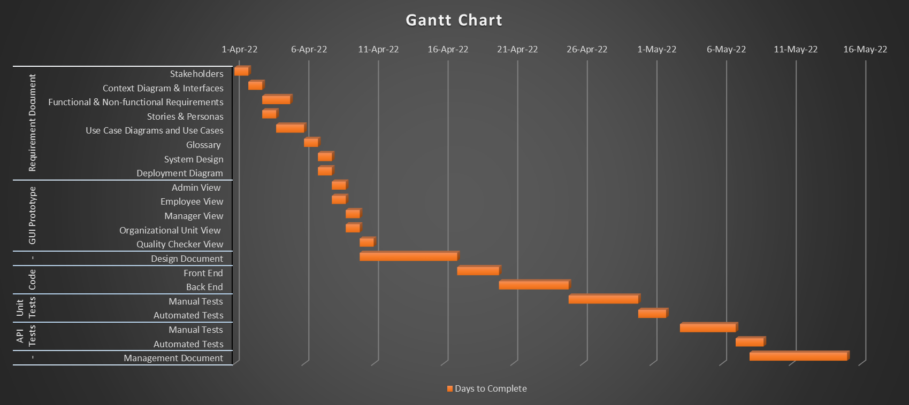

# Project Estimation

Date: 9 april 2022

Version:

# Estimation approach

Consider the EZWH  project as described in YOUR requirement document, assume that you are going to develop the project INDEPENDENT of the deadlines of the course

# Estimate by size

###
|                                                                                                         | Estimate |
| ------------------------------------------------------------------------------------------------------- | --------:|
| NC =  Estimated number of classes to be developed                                                       |       20 |
| A = Estimated average size per class, in LOC                                                            |      350 |
| S = Estimated size of project, in LOC (= NC * A)                                                        |     7000 |
| E = Estimated effort, in person hours (here use productivity 10 LOC per person hour)                    |      700 |
| C = Estimated cost, in euro (here use 1 person hour cost = 30 euro)                                     |    21000 |
| Estimated calendar time, in calendar weeks (Assume team of 4 people, 8 hours per day, 5 days per week ) |      4.5 |

# Estimate by product decomposition

###
| Component name       | Estimated effort (person hours) |
| -------------------- | -------------------------------:|
| requirement document | 150 |
| GUI prototype        |  80 |
| design document      | 200 |
| code                 | 250 |
| unit tests           | 200 |
| api tests            | 150 |
| management documents | 200 |

# Estimate by activity decomposition

### 
| Activity name                              | Estimated effort (person hours) |
| ------------------------------------------ | ------------------------------- |
| 1. Requirement Doc                         |     |
| - Stakeholders                             |  10 |
| - Context Diagram & Interfaces             |  20 |
| - Functional & Non-functional Requirements |  30 |
| - Stories & Personas                       |  20 |
| - Use Case Diagrams and Use Cases          |  30 |
| - Glossary                                 |  20 |
| - System Design                            |  10 |
| - Deployment Diagram                       |  10 |
| 2. GUI Prototype                           |     |
| - Admin View                               |  16 |
| - Employee View                            |  16 |
| - Manager View                             |  16 |
| - Organizational Unit View                 |  16 |
| - Quality Checker View                     |  16 |
| 3. Design Document                         | 200 |
| 4. Code                                    |     |
| - Front-end                                | 100 |
| - Back-end                                 | 150 |
| 5. Unit Tests                              |     |
| - Manual Unit Tests                        | 150 |
| - Automated Unit Tests                     |  50 |
| 6. API Tests                               |     |
| - Manual Tests                             | 100 |
| - Automated Tests                          |  50 |
| 7. Management Document                     | 200 |

###

# Summary

Report here the results of the three estimation approaches. The  estimates may differ. Discuss here the possible reasons for the difference

|                                    | Estimated effort | Estimated duration |
| ---------------------------------- | ---------------- | ------------------ |
| estimate by size                   | | |
| estimate by product decomposition  | | |
| estimate by activity decomposition | | |
