# Graphical User Interface Prototype  

Authors: team 48
Date: 12/04/2022
Version: 0.5

| Version number | Change |
| ----------------- |:-----------|
| 0.1 | drawn initial sketch |
| 0.2 | clickable demos (manager, quality check and OUI) implemented using free Uizard tool |
| 0.3 | added admin and employee view |
| 0.4 | definitive peer review and fine tuning |

It all started from this sketch:
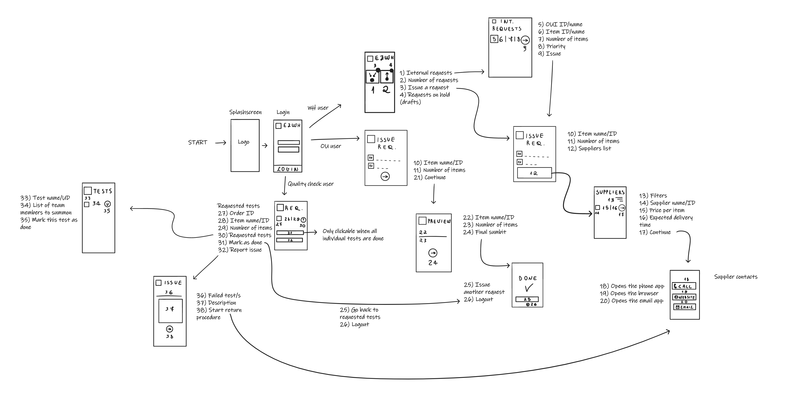

# Our GUI followed some main principles
| Principle| Description |
| ----------------- |:-----------:|
| Simplicity | nothing is more complicated than it needs to be, and everything is just some clicks away. The GUI should be usable without heavy education from corporate (avoiding communication problems and other shortcomings) |
| Clarity | using IDs is avoided as much as possible, and the user may rather search by name or input a name | 
| Coherence | the elements accross the GUI all follow the same pattern, so that users know where to go and what to expect at any given point |
| Intuitive colors | we opted for a minimal and pretty common color scheme: the main color is blue (which is known to be calming) and then we have magenta (secondary color) and the usual green vs red dichotomy (whenever something has gone right or wrong) |
| Reachability | the main functions are located near to the user's thumb, making it comfortable to use everyday. No header is actionable nor needs to be touched |
| Animations | they're natural and follow the flow of execution. They make the GUI more pleasant to use |
# Please note 
Uizard free account makes you add up to 3 projects (and up to 10 screens each). Hence, the admin view was implemented separately and may present some minor inconsistencies with the others. Also, the splashscreen and login screens are only provided in the OUI and quality check views. Managers will have mXXXXXX usernames, admins aXXXXXX, quality check qXXXXXX, OUI oXXXXXX
## Manager view
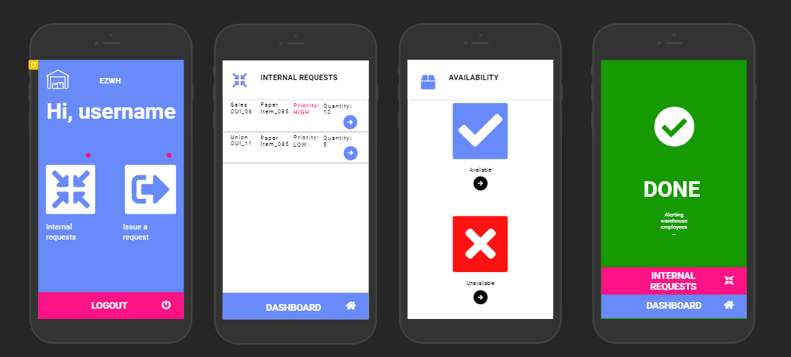
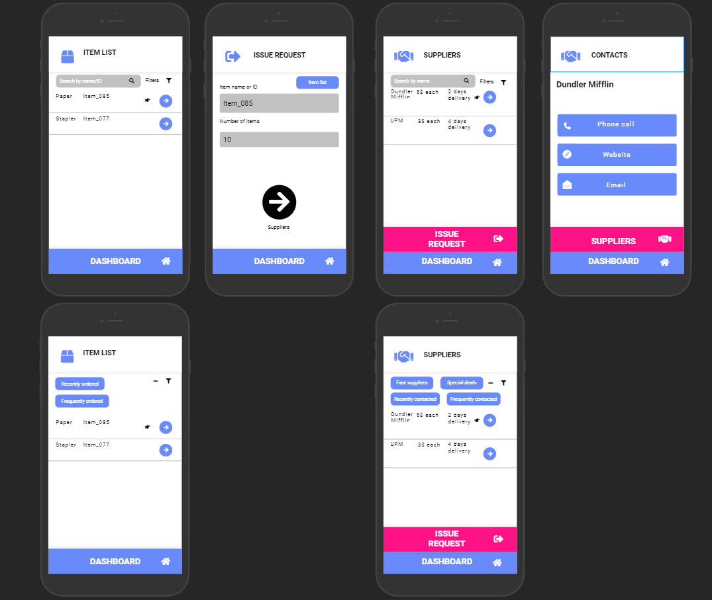
Clickable demo: https://app.uizard.io/p/15b61ed3
## Admin view
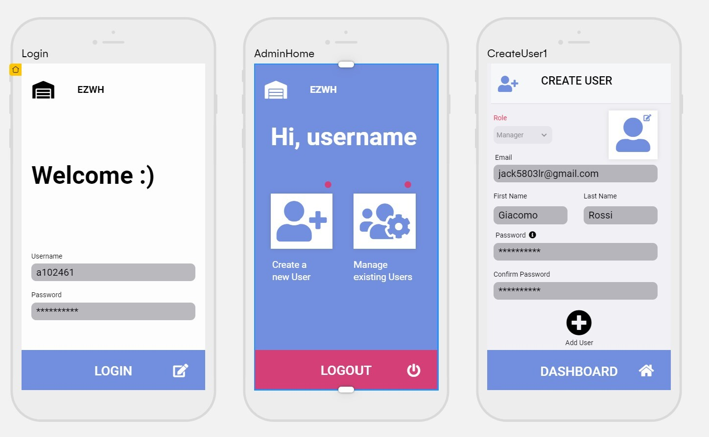
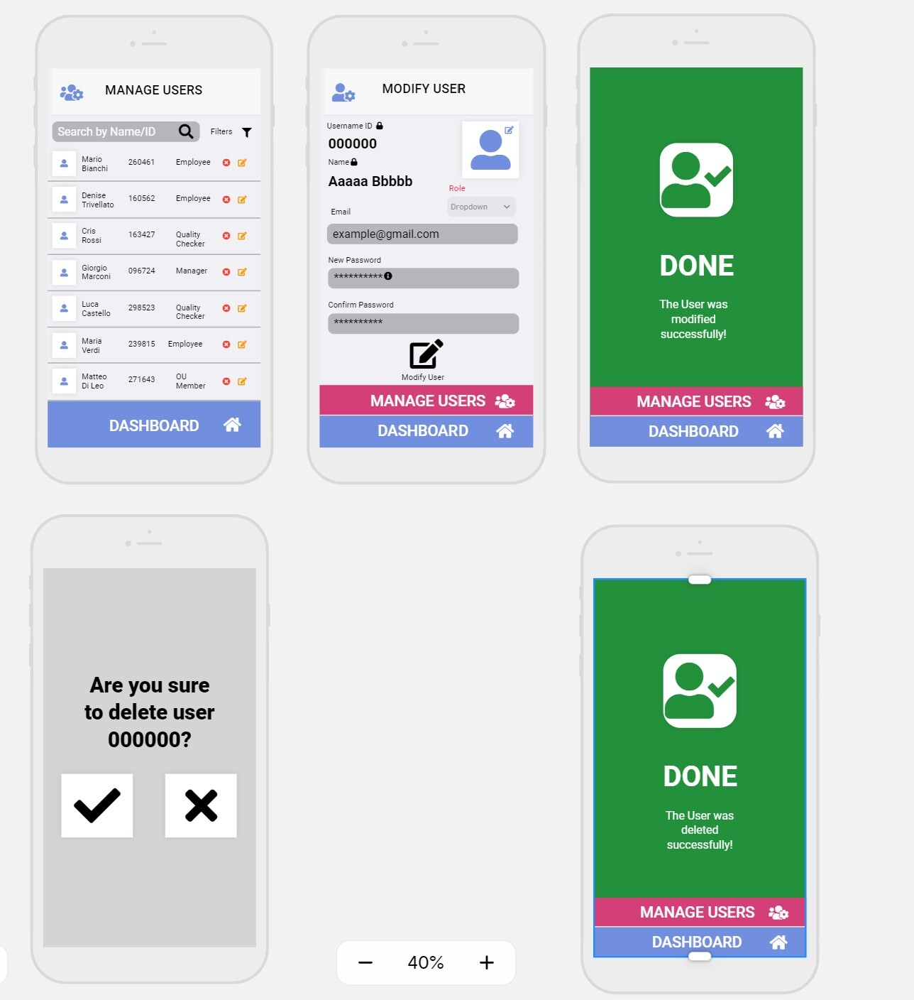
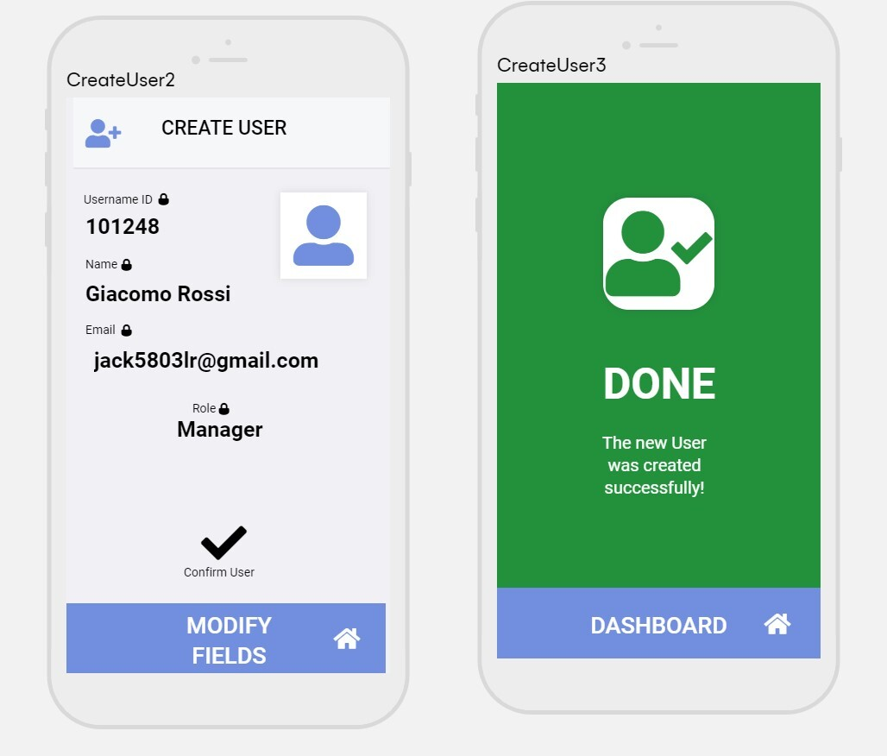
Clickable demo: https://app.uizard.io/p/d533cb8c
## Quality check view
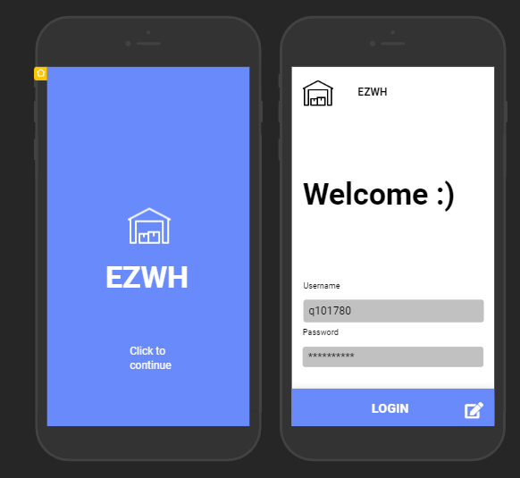
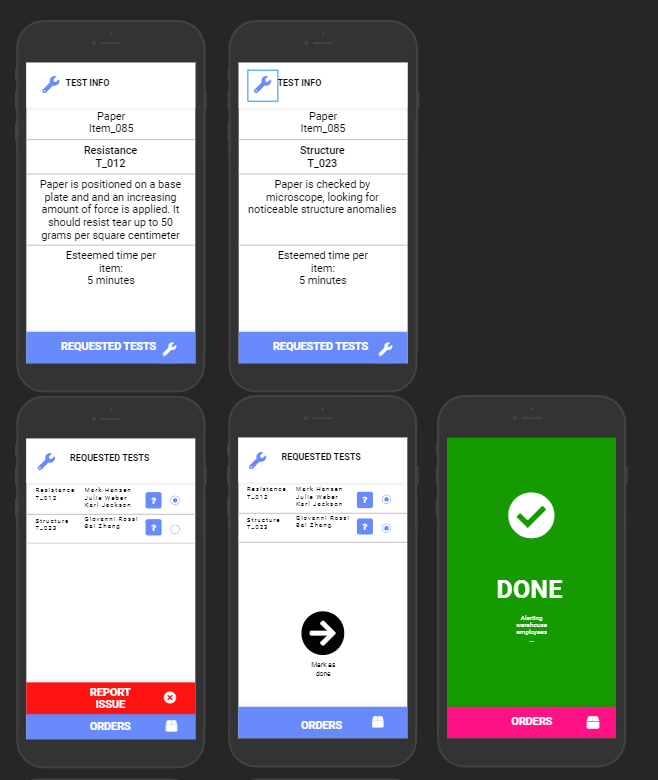
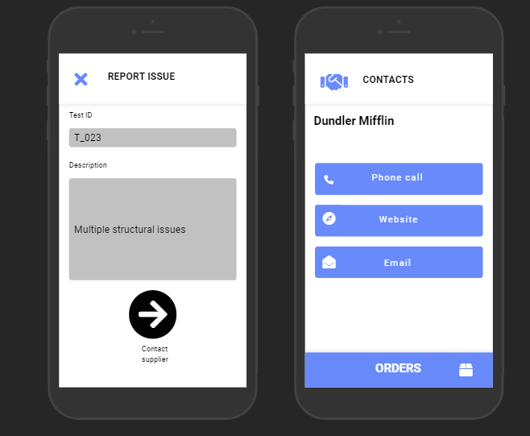
Clickable demo: https://app.uizard.io/p/2dfd9fed
## OUI view 
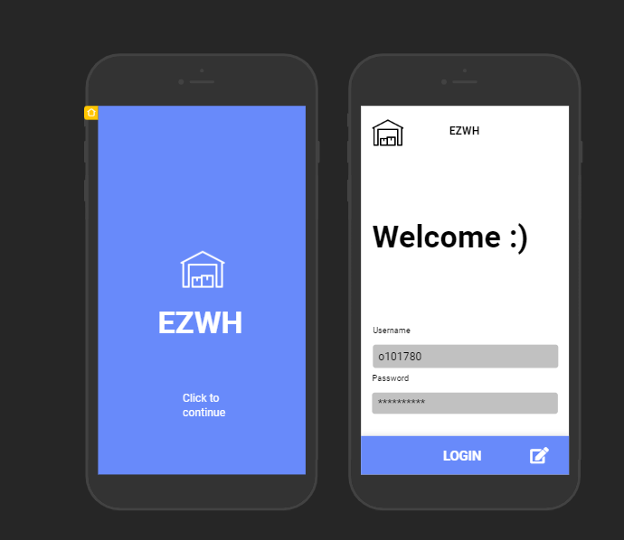
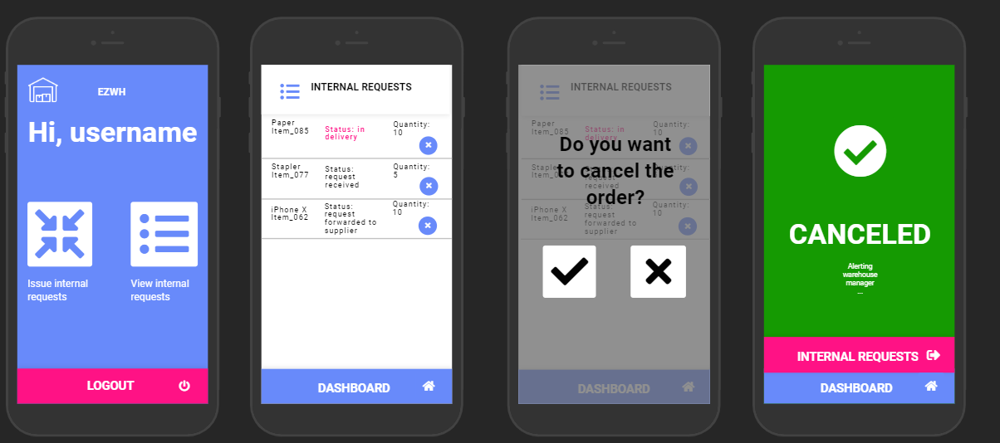
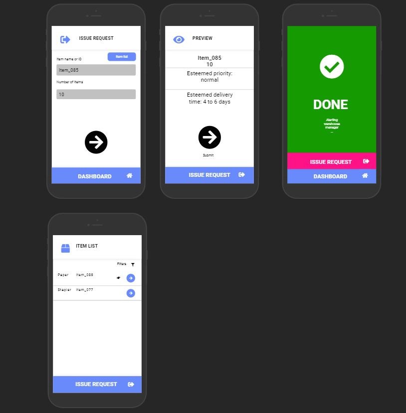
Cliackable demo: https://app.uizard.io/p/c0ca3cdd
