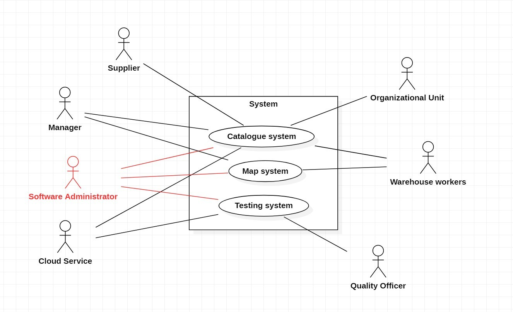

# Requirements Document

Date: 22 march 2022

Version: 0.3

| Version number | Change |
| ----------------- |:-----------|
| 0.1 | compiled stakeholders, context diagram, interfaces, functional and non functional requirements |
| 0.2 | fixed shareholder header |
| 0.3 | added two more personas |

# Contents

- [Informal description](#informal-description)
- [Stakeholders](#stakeholders)
- [Context Diagram and interfaces](#context-diagram-and-interfaces)
	+ [Context Diagram](#context-diagram)
	+ [Interfaces](#interfaces)

- [Stories and personas](#stories-and-personas)
- [Functional and non functional requirements](#functional-and-non-functional-requirements)
	+ [Functional Requirements](#functional-requirements)
	+ [Non functional requirements](#non-functional-requirements)
- [Use case diagram and use cases](#use-case-diagram-and-use-cases)
	+ [Use case diagram](#use-case-diagram)
	+ [Use cases](#use-cases)
    	+ [Relevant scenarios](#relevant-scenarios)
- [Glossary](#glossary)
- [System design](#system-design)
- [Deployment diagram](#deployment-diagram)

# Informal description

Medium companies and retailers need a simple application to manage the relationship with suppliers and the inventory of physical items stocked in a physical warehouse.
The warehouse is supervised by a manager, who supervises the availability of items. When a certain item is in short supply, the manager issues an order to a supplier. In general the same item can be purchased by many suppliers. The warehouse keeps a list of possible suppliers per item.

After some time the items ordered to a supplier are received. The items must be quality checked and stored in specific positions in the warehouse. The quality check is performed by specific roles (quality office), who apply specific tests for item (different items are tested differently). Possibly the tests are not made at all, or made randomly on some of the items received. If an item does not pass a quality test it may be rejected and sent back to the supplier.

Storage of items in the warehouse must take into account the availability of physical space in the warehouse. Further the position of items must be traced to guide later recollection of them.

The warehouse is part of a company. Other organizational units (OU) of the company may ask for items in the warehouse. This is implemented via internal orders, received by the warehouse. Upon reception of an internal order the warehouse must collect the requested item(s), prepare them and deliver them to a pick up area. When the item is collected by the other OU the internal order is completed.

EZWH (EaSy WareHouse) is a software application to support the management of a warehouse.

# Stakeholders

| Stakeholder name  | Description |
| ----------------- |:-----------:|
| The company / retailer | Who owns the warehouse and resells the items |
| Manager | Who supervises the availability of items in the Warehouse |
| Supplier | Who provides items to the company |
| Catologue system | A system who manage items |
| Quality Officer | One of the team who performs quality check applying specific tests for item |
| Organizational Unit (OU) | A part of the company who may ask for items into the warehouse via internal orders |
| Software Administrator | Who maintain the software |
| Cloud Service | Cloud services for operation |
| Warehouse worker | Who works in the warehouse |
| Warehouse Map System | An internal sytem that maps items in the warehouse |
| Testing System | A system used by the Quality Office for manage the testing of items |
| Competitors | Others apps which offer the same services |
| Start-up owner/partner/financer | People who finance the app developing |
| Application Store | The App Stores where we have to sell the app |
| Marketing Team | The team that promotes the app on different platforms |
| Maintanance Server | Server responsible for CI/CD of the software |

# Context Diagram and interfaces

## Context Diagram

Actors:
- warehouse manager
- warehouse worker
- suppliers
- Quality check officier
- OU managers
- software administrator
- cloud service server
- software update server

## Interfaces

| Actor | Logical Interface | Physical Interface  |
| ------------- |:-------------:| -----:|
| Warehouse manager | Graphical User Interface | Computer or smartphone's screen |
| Warehouse worker | Graphical User Interface, Bar code | Computer or smartphone's screen, Bar code scanner |
| Supplier | Email/Website/Telephone | Computer or smartphone's screen |
| Quality check officier | Graphical User Interface | Computer or smartphone's screen |
| OU managers | Graphical User Interface | Computer or smartphone's screen |
| Software Administrator | Management Tools | Computer or smartphone's screen |
| Cloud service | API | Internet connection |
| Software update | API | Internet connection |

# Stories and personas

Persona 1: Manager, male, 48 yo, married; this is my job:
- I check the current stock of the warehouse
- I identify the low stock products
- I browse the catalogue (maybe sorting by price, availability, delivery time)
- I place an order on the supplier website
- I pay through the website payment system
- I record what and how i paid on EZWH

Persona 2: Quality checker, male, 50 yo, married; this my job:
- I receive an alert fromm the app, listing the tests my team needs to perform on the arriving items
- I summon the members of my team who should perform those
- I supervise their job
- They give me the tests results, which I have to communicate to the app
- If there's no issue my work ends here
- If there are issues I have to start a return procedure
- In that case, I have to secure the order to the carrier to take it back

Persona 3: Warehouse worker, 29 yo, female; this is my job:
- I check the application for pending orders
- I collect the ordered items
- I package/prepare ordered items
- I deliver them to the pick up area where other OU collects it

Persona 4: OU manager, female, 42 yo; this is my job:
- I check if my Organizatinal Unit has a need for a specific item
- I check if the item is available in the warehouse
- I place an order to the warehouse for that specific item using EZWH
- I wait for the delivery of the item

Persona 5: Software administrator, male, 35 yo; this is my job:
- I check the ticketing system for any issue related to EZWH
- I fix the issue remotely whenever possible
- Whenever a new employee needs to use EZWH, I create the user account and assign the right permissions
- Whenever there is a new update for EZWH, I make sure the update has beed installed correctly and everything works as intended

# Functional and non functional requirements

## Functional Requirements

| ID      | Description |
| ------- |:-----------:|
|  FR1    | Keep track of products present in the warehouse |
|  FR1.1  | Add/remove/modify products |
|  FR1.2  | Notify if stock is low |
|  FR1.3  | Keep track of location of products in the warehouse |
|  FR2    | Issue order to supplier |
|  FR2.1  | View order status/modify/cancel |
|  FR2.2  | Select best supplier per item based on price, availability, delivery date... |
|  FR2.3  | Order priority |
|  FR2.4  | Notifications when orders are due |
|  FR3    | Keep track of suppliers |
|  FR3.1  | Add/remove/modify suppliers in list |
|  FR4    | Keep track of received items from supplier |
|  FR4.1  | Mark items as received |
|  FR4.2  | Note issues during delivery or quality check |
|  FR4.3  | Note which tests are performed and if they are passed |
|  FR4.4  | Issue item reorder if necessary or notify warehouse manager |
|  FR5    | Keep track of physical space in warehouse |
|  FR5.1  | Add/remove warehouses |
|  FR6    | Keep track of internal orders from Organizational Units |
|  FR6.1  | Place/modify/cancel order to warehouse |
|  FR6.2  | Keep track of order status (preparation, delivery, completed...) |
|  FR7    | Manage users |
|  FR7.1  | Create/delete/modify users |
|  FR7.2  | Login/logout, keep user signed in |
|  FR7.3  | Manage user permissions |
|  FR8    | Update application |
|  FR8.1  | Automatic updates |
|  FR9    | Backups |

## Non Functional Requirements

|  ID     | Type (efficiency, reliability...) | Description  | Refers to |
| ------- |:---------------------------------:| :-----------:| ---------:|
|  NFR1   |  Reliability  | Software shouldn't have more than x days of downtime every year | |
|  NFR2   |  Reliability  | Software should perform automatic backups and automatically restore after crash | FR9 |
|  NFR3   |  Usability    | Users should be able to use the software with 2 hours training | |
|  NFR4   |  Usability    | Maximum number of clicks for common operations | |
|  NFR5   |  Efficiency   | Software should respond in less than 0.5s | |
|  NFR6   |  Efficiency   | Software should be able to run on older hardware | |
|  NFR7   |  Efficiency   | Software should use less than x MB of memory | |
|  NFR8   |  Portability  | Software should run on all platforms (web interface for mobile/desktop) | |
|  NFR9   |  Security     | Software should accept only complex password | FR7 |
|  NFR10  |  Security     | Software should support multiple authentication methods (Multi factor authentication) | FR7 |
|  NFR11  |  Security     | Software should give access to data only to authorized users | FR7 |
|  NFR12  |  Security     | Mandatory updates | FR8 |

# Use case diagram and use cases

## Use case diagram
\<define here UML Use case diagram UCD summarizing all use cases, and their relationships>

\<next describe here each use case in the UCD>

### Use case 1, UC1

| Actors Involved        |  |
| ------------- |:-------------:|
|  Precondition     | \<Boolean expression, must evaluate to true before the UC can start> |
|  Post condition     | \<Boolean expression, must evaluate to true after UC is finished> |
|  Nominal Scenario     | \<Textual description of actions executed by the UC> |
|  Variants     | \<other normal executions> |
|  Exceptions     | \<exceptions, errors > |

##### Scenario 1.1

\<describe here scenarios instances of UC1>

\<a scenario is a sequence of steps that corresponds to a particular execution of one use case>

\<a scenario is a more formal description of a story>

\<only relevant scenarios should be described>

| Scenario 1.1 | |
| ------------- |:-------------:|
|  Precondition     | \<Boolean expression, must evaluate to true before the scenario can start> |
|  Post condition     | \<Boolean expression, must evaluate to true after scenario is finished> |
| Step#        | Description  |
|  1     |  |
|  2     |  |
|  ...     |  |

##### Scenario 1.2

##### Scenario 1.x

### Use case 2, UC2
..

### Use case x, UCx
..

# Glossary

\<use UML class diagram to define important terms, or concepts in the domain of the system, and their relationships>

\<concepts are used consistently all over the document, ex in use cases, requirements etc>

# System Design

\<describe here system design>

\<must be consistent with Context diagram>

# Deployment Diagram

\<describe here deployment diagram >
