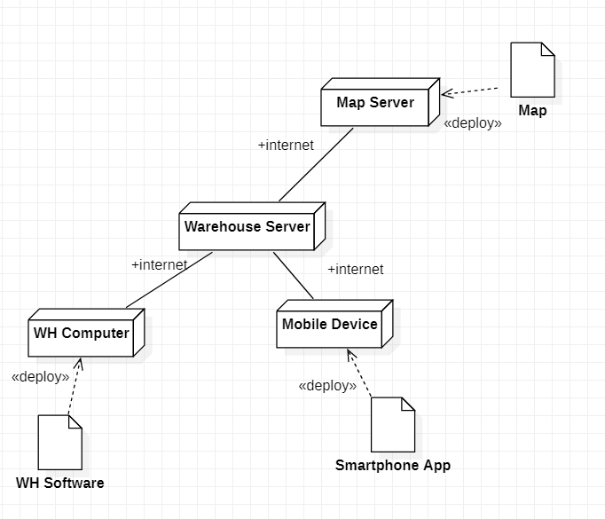

# Requirements Document

Date: 22 march 2022

Version: 0.6

| Version number | Change |
| ----------------- |:-----------|
| 0.1 | compiled stakeholders, context diagram, interfaces, functional and non functional requirements |
| 0.2 | fixed shareholder header |
| 0.3 | added two more personas |
| 0.4 | added use cases 1-7 |
| 0.5 | added use case diagram, glossary, system design and deployement diagram |
| 0.6 | added access rights |

# Contents

- [Informal description](#informal-description)
- [Stakeholders](#stakeholders)
- [Context Diagram and interfaces](#context-diagram-and-interfaces)
	+ [Context Diagram](#context-diagram)
	+ [Interfaces](#interfaces)

- [Stories and personas](#stories-and-personas)
- [Functional and non functional requirements](#functional-and-non-functional-requirements)
	+ [Functional Requirements](#functional-requirements)
	+ [Non functional requirements](#non-functional-requirements)
- [Use case diagram and use cases](#use-case-diagram-and-use-cases)
	+ [Use case diagram](#use-case-diagram)
	+ [Use cases](#use-cases)
    	+ [Relevant scenarios](#relevant-scenarios)
- [Glossary](#glossary)
- [System design](#system-design)
- [Deployment diagram](#deployment-diagram)

# Informal description

Medium companies and retailers need a simple application to manage the relationship with suppliers and the inventory of physical items stocked in a physical warehouse.
The warehouse is supervised by a manager, who supervises the availability of items. When a certain item is in short supply, the manager issues an order to a supplier. In general the same item can be purchased by many suppliers. The warehouse keeps a list of possible suppliers per item.

After some time the items ordered to a supplier are received. The items must be quality checked and stored in specific positions in the warehouse. The quality check is performed by specific roles (quality office), who apply specific tests for item (different items are tested differently). Possibly the tests are not made at all, or made randomly on some of the items received. If an item does not pass a quality test it may be rejected and sent back to the supplier.

Storage of items in the warehouse must take into account the availability of physical space in the warehouse. Further the position of items must be traced to guide later recollection of them.

The warehouse is part of a company. Other organizational units (OU) of the company may ask for items in the warehouse. This is implemented via internal orders, received by the warehouse. Upon reception of an internal order the warehouse must collect the requested item(s), prepare them and deliver them to a pick up area. When the item is collected by the other OU the internal order is completed.

EZWH (EaSy WareHouse) is a software application to support the management of a warehouse.

# Stakeholders

| Stakeholder name  | Description |
| ----------------- |:-----------:|
| The company / retailer | Who owns the warehouse and resells the items |
| Manager | Who supervises the availability of items in the Warehouse |
| Supplier | Who provides items to the company |
| Catologue system | A system who manage items |
| Quality Officer | One of the team who performs quality check applying specific tests for item |
| Organizational Unit (OU) | A part of the company who may ask for items into the warehouse via internal orders |
| Software Administrator | Who maintain the software |
| Cloud Service | Cloud services for operation |
| Warehouse worker | Who works in the warehouse |
| Warehouse Map System | An internal sytem that maps items in the warehouse |
| Testing System | A system used by the Quality Office for manage the testing of items |
| Competitors | Others apps which offer the same services |
| Start-up owner/partner/financer | People who finance the app developing |
| Application Store | The App Stores where we have to sell the app |
| Marketing Team | The team that promotes the app on different platforms |
| Maintanance Server | Server responsible for CI/CD of the software |

# Context Diagram and interfaces

## Context Diagram

Actors:
- warehouse manager
- warehouse worker
- suppliers
- Quality check officer
- OU managers
- software administrator
- cloud service server
- software update server

## Interfaces

| Actor | Logical Interface | Physical Interface  |
| ------------- |:-------------:| -----:|
| Warehouse manager | Graphical User Interface | Computer or smartphone's screen |
| Warehouse worker | Graphical User Interface, Bar code | Computer or smartphone's screen, Bar code scanner |
| Supplier | Email/Website/Telephone | Computer or smartphone's screen |
| Quality check officer | Graphical User Interface | Computer or smartphone's screen |
| OU managers | Graphical User Interface | Computer or smartphone's screen |
| Software Administrator | Management Tools | Computer or smartphone's screen |
| Cloud service | API | Internet connection |
| Software update | API | Internet connection |

# Stories and personas

Persona 1: Manager, male, 48 yo, married; this is my job:
- I check the current stock of the warehouse
- I identify the low stock products
- I browse the catalogue (maybe sorting by price, availability, delivery time)
- I place an order on the supplier website
- I pay through the website payment system
- I record what and how i paid on EZWH

Persona 2: Quality checker, male, 50 yo, married; this my job:
- I receive an alert fromm the app, listing the tests my team needs to perform on the arriving items
- I summon the members of my team who should perform those
- I supervise their job
- They give me the tests results, which I have to communicate to the app
- If there's no issue my work ends here
- If there are issues I have to start a return procedure
- In that case, I have to secure the order to the carrier to take it back

Persona 3: Warehouse worker, 29 yo, female; this is my job:
- I check the application for pending orders
- I collect the ordered items
- I package/prepare ordered items
- I deliver them to the pick up area where other OU collects it

Persona 4: OU manager, female, 42 yo; this is my job:
- I check if my Organizatinal Unit has a need for a specific item
- I check if the item is available in the warehouse
- I place an order to the warehouse for that specific item using EZWH
- I wait for the delivery of the item

Persona 5: Software administrator, male, 35 yo; this is my job:
- I check the ticketing system for any issue related to EZWH
- I fix the issue remotely whenever possible
- Whenever a new employee needs to use EZWH, I create the user account and assign the right permissions
- Whenever there is a new update for EZWH, I make sure the update has beed installed correctly and everything works as intended

# Functional and non functional requirements

## Functional Requirements

| ID      | Description |
| ------- |:-----------:|
|  FR1    | Keep track of products present in the warehouse |
|  FR1.1  | Add/remove/modify products |
|  FR1.2  | Notify if stock is low |
|  FR1.3  | Keep track of location of products in the warehouse |
|  FR2    | Issue order to supplier |
|  FR2.1  | View order status/modify/cancel |
|  FR2.2  | Select best supplier per item based on price, availability, delivery date... |
|  FR2.3  | Order priority |
|  FR2.4  | Notifications when orders are due |
|  FR3    | Keep track of suppliers |
|  FR3.1  | Add/remove/modify suppliers in list |
|  FR4    | Keep track of received items from supplier |
|  FR4.1  | Mark items as received |
|  FR4.2  | Note issues during delivery or quality check |
|  FR4.3  | Note which tests are performed and if they are passed |
|  FR4.4  | Issue item reorder if necessary or notify warehouse manager |
|  FR5    | Keep track of physical space in warehouse |
|  FR5.1  | Add/remove warehouses |
|  FR6    | Keep track of internal orders from Organizational Units |
|  FR6.1  | Place/modify/cancel order to warehouse |
|  FR6.2  | Keep track of order status (preparation, delivery, completed...) |
|  FR7    | Manage users |
|  FR7.1  | Create/delete/modify users |
|  FR7.2  | Login/logout, keep user signed in |
|  FR7.3  | Manage user permissions |
|  FR8    | Update application |
|  FR8.1  | Automatic updates |
|  FR9    | Backups |

### Access right, actor vs function

| Function | Administrator | Warehouse Manager | Warehouse Worker | QC officer | OU Manager |
| -------- |:-------------:|:-----------------:|:----------------:|:-----------:|:----------:|
| FR1      | no            | yes               | yes              | yes         | no         |
| FR2      | no            | yes               | no               | yes*        | no         |
| FR3      | no            | yes               | no               | no          | no         |
| FR4.1    | no            | yes               | yes              | no          | no         |
| FR4.2    | no            | yes               | yes              | yes         | no         |
| FR4.3-4  | no            | yes               | no               | yes         | no         |
| FR5      | no            | yes               | yes              | no          | no         |
| FR5.1    | no            | yes               | no               | no          | no         |
| FR6      | no            | yes               | no               | no          | yes        |
| FR6.2    | no            | yes               | yes              | no          | yes        |
| FR7      | yes           | no                | no               | no          | no         |

\*QC officer can issue orders only in case the item does not pass the specified tests

## Non Functional Requirements

|  ID     | Type (efficiency, reliability...) | Description  | Refers to |
| ------- |:---------------------------------:| :-----------:| ---------:|
|  NFR1   |  Reliability  | Software shouldn't have more than x days of downtime every year | |
|  NFR2   |  Reliability  | Software should perform automatic backups and automatically restore after crash | FR9 |
|  NFR3   |  Usability    | Users should be able to use the software with 2 hours training | |
|  NFR4   |  Usability    | Maximum number of clicks for common operations | |
|  NFR5   |  Efficiency   | Software should respond in less than 0.5s | |
|  NFR6   |  Efficiency   | Software should be able to run on older hardware | |
|  NFR7   |  Efficiency   | Software should use less than x MB of memory | |
|  NFR8   |  Portability  | Software should run on all platforms (web interface for mobile/desktop) | |
|  NFR9   |  Security     | Software should accept only complex password | FR7 |
|  NFR10  |  Security     | Software should support multiple authentication methods (Multi factor authentication) | FR7 |
|  NFR11  |  Security     | Software should give access to data only to authorized users | FR7 |
|  NFR12  |  Security     | Mandatory updates | FR8 |

# Use case diagram and use cases

## Use case diagram

### Use case 1, UC1 - Manage Items

| Actors Involved        | Warehouse manager |
| ------------- |:-------------:|
|  Precondition |  |
|  Post condition |  |
|  Nominal Scenario |  Manager creates a new Item type IT populating its fields  |
|  Variants     | IT exists already, Manager modifies its fields  |
| | IT is assigned to an occupied location, issue warning |
| | IT is assigned to an existing barcode , issue warning |

##### Scenario 1.1

| Scenario 1.1 |  Creating new Item Type |
| ------------- |:-------------:|
|  Precondition     | Manager M exists and is logged in |
|  Post condition     | New Item Type IT Added  |
| Step#        | Description  |
|  1    |  M click the 'Add' button |
|  2    |  M insterts Item description in the forms |
|  3    |  System checks if the Item already exists |
|  4	|  IT is Added to the database 	|

##### Scenario 1-2

| Scenario |  Modify Item type fields (bar code)|
| ------------- |:-------------:|
|  Precondition     | Manager M exists and is logged in |
|  | Item type I exists |
|  | Location L is free |
|  Post condition     | I fields are updated |
| Step#        | Description  |
|  1    |  M searches I via bar code |
|  2    |  M selects I's record |
|  3    |  M selects a new field |

##### Scenario 1-3

| Scenario |  Modify Item type fields (ID)|
| ------------- |:-------------:|
|  Precondition     | Manager M exists and is logged in |
|  | Item type I exists |
|  | Location L is free |
|  Post condition     | I fields are updated |
| Step#        | Description  |
|  1    |  M searches I via ID |
|  2    |  M selects I's record |
|  3    |  M selects a new field |

### Use case 2, UC2 - Manage users and rights

| Actors Involved        | Administrator, Warehouse workers |
| ------------- |:-------------:|
| Precondition | Administrator A logged in |
| Post condition | |
| Nominal Scenario | A defines a new user and its access rights |
| Variants     | A modifies fields or access rights of an existing user |

##### Scenario 2-1

| Scenario |  Create user and define rights |
| ------------- |:-------------:|
| Precondition   | Administrator A exists and is logged in |
| Post condition | Account X is created |
| Step#        | Description  |
|  1    |  A defines the credentials of the new Account X |
|  2    |  A selects the access rights for the new account X |
|  3    |  A confirms the inserted data |

##### Scenario 2-2

| Scenario |  Delete user |
| ------------- |:-------------:|
| Precondition     | Administrator A exists and is logged in |
|                  | Account X exists |
| Post condition   | Account X deleted |
| Step#        | Description  |
|  1    |  A selects account X  |
|  2    |  X deleted from the system |

##### Scenario 2-3

| Scenario |  Modify user access rights |
| ------------- |:-------------:|
| Precondition     | Admin A exists and is logged in |
|                  | Account X exists |
| Post condition   | X's rights updated |
| Step#        | Description  |
|  1    |  A selects account X  |
|  2    |  A selects the access rights for X |
|  3    |  A confirms the inserted data |

### Use case 3, UC3 - Manage External orders

| Actors Involved        | Warehouse Manager, Supplier, Warehouse workers |
| ------------- |:-------------:|
|  Precondition | Item type IT exists |
|  Post condition | External Order O for IT exists  |
|  Nominal Scenario |  Manager creates new external order O for Item IT. Manager sends order to Supplier. When order arrives to the Warehouse, manager records order arrival and warehouse workers store the Item. |
|  Variants     | Creation of external order, IT does not exist, issue warning |
|  | IT quantity doesn't require an external orden |

##### Scenario 3-1

| Scenario |  Create new External Order|
| ------------- |:-------------:|
|  Precondition     | Manager M exists and is logged in |
|	| Item Type IT exists|
|  Post condition     | New External Order EO is created |
| Step#        | Description  |
|  1    |  M searches IT via ID or BarCode |
|  2    |  M selects a Supplier form the Supplier List SL of the IT|
|  3    |  M clicks button "Order" |
|  4	|  M selects quantity and confirm|
|  5	|  New EO is collected by the system |

##### Scenario 3-2

| Scenario | Store the External Order |
| ------------- |:-------------:|
|  Precondition     | Manager M exists and is logged in |
| 				| Warehouse worker User U exists and is logged in |
| 				| External order EO exists |
|				| Quality Checker QC exists |
|  Post condition     | EO is stored |
| Step#        | Description  |
|  1    |  EO is colected in the warehouse |
|  2    |  U scan the barcode of the IT |
|  3    | System updates the EO status |
|  4	|  U sends the EO to the Quality Check |
|  5	|  U receives the EO checked from the Qulity Check |
|  6	|  U searches the IT position form the App |
|  7	|  U stores the IT in the warehouse |
|  8	|  System updates the quantity field of the IT |

### Use case 4, UC4 - Manage quality checks

| Actors Involved        | Quality Officer |
| ------------- |:-------------:|
|  Precondition   | Tests list TL for each item type IT exixts, Probability P for item type IT to be checked exists |
|  Post condition     |                                 |
|  Nominal Scenario     | Item is supplied to the Warehouse, Quality Office start to checks Item with his tests, Item passes tests, Item is stored   |
|  Variants     | Item  doesn't pass tests, Item is returned |
|  				| Adding/remove/modify quality tests to the list T |

##### Scenario 4-1

| Scenario | Test prepare |
| ------------- |:-------------:|
|  Precondition | Qualyty Officer QC exists and is logged in |
| 				| External order EO exists |
|  Post condition     | Item list from EO to be checked exists |
| Step#        | Description  |
|  1    |  EO is collected in the Quality Office |
|  2    |  QC scan the barcode of the IT |
|  3    | System updates the EO status |
|  7	| QC clicks on 'Test' button |
|  8	| System outputs a random list IT from the EO to be checked |

##### Scenario 4-2

| Scenario | Item Checking (Test Success) |
| ------------- |:-------------:|
|  Precondition | Quality Officer QC exists and is logged in |
| 				| External order EO exists |
|				| IT list ITL of item to be checked exists|
|  Post condition     | EO is checked|
| Step#        | Description  |
|  1    |  QC select an item from ITL |
|  2    |  System outputs a random Test Sublist from the TL of the IT to be checked |
|  3    | QC tests the Item |
|  7	| System records test results |
|  8	| Item passed all test |
|  9	| QC starts the storage procedure |

##### Scenario 4-3

| Scenario | Item Checking (Test Fails) |
| ------------- |:-------------:|
|  Precondition | Qualyty Officer QC exists and is logged in |
| 				| External order EO exists |
|				| IT list ITL of item to be checked exists|
|  Post condition     | EO is returned |
| Step#        | Description  |
|  1    |  QC select an item from ITL |
|  2    |  System outputs a random Test Sublist from the TL of the IT to be checked |
|  3    | QC tests the Item |
|  7	| System records test results |
|  8	| Item fail one or more test |
|  9	| QC notify the Manager about possible return procedure |

##### Scenario 4-4

| Scenario | Test List update |
| ------------- |:-------------:|
|  Precondition | Qualyty Officer QC exists and is logged in |
|				| Item Type IT exists |
|  Post condition     | Test List TL of an ites is updated |
| Step#        | Description  |
|  1    | QC searches an IT via ID |
|  3    | QC clicks on the Test field |
|  7	| QC clicks on 'modify' button |
|  8	| QC inserts/deletes/updates a test from the TL |
|  9	| QC confirms inserted data  |

### Use case 5, UC5 - Manage internal orders

| Actors Involved  | Warehouse Manager, Warehouse Worker, Organizational Unit (OU) |
| ---------------- |:-------------:|
| Precondition     | Item type IT exists |
|                  | OU manager exists and is logged in |
| Post condition   | Item IT is collected by OU |
| Nominal Scenario | An OU creates and Internal Order IO for Item IT. OU sends order to Manager. Warehouse workers collect Item IT and place it in the pick up area. Item is collected by OU |
| Variants         | Item IT is not available in the warehouse, issue warning |
|                  | Internal order is canceled |

##### Scenario 5-1

| Scenario       | OU requests item to Warehouse |
| -------------- |:-------------:|
| Precondition   | Item type IT exists |
|                | OU manager M exists and is logged in |
| Post condition | Internal Order IO is processed by the system |
| Step#          | Description  |
|  1             | M opens the App in the page dedicated to Internal Orders |
|  2             | M selects IT from a list |
|  3             | M clicks on Order |
|  4             | M inserts the quantity and confirms |
|  5             | IO is successfully ordered and a notification is sento to the warehouse |

##### Scenario 5-2

| Scenario       | Internal order is processed by the warehouse |
| -------------- |:-------------:|
| Precondition   | Internal order IO exists |
|                | Warehouse Worker WW exists and is logged in |
| Post condition | Item IT is collected by OU in the pickup area |
| Step#          | Description  |
|  1             | WW receives a notification for IO |
|  2             | WW collects and packages IT |
|  3             | WW moves the package to pickup area |
|  4             | WW marks the order as delivered |
|  5             | Organizational Unit employee collects IT from pickup area |
|  6             | OU employee marks the order as completed |

### Use case 6, UC6 - Authenticate, authorize

| Actors Involved  | Software Administrator, Warehouse Worker |
| ------------- |:-------------:|
|  Precondition | User U exists |
|  Post condition     |                                 |
|  Nominal Scenario     | Login: user enters credentials, system checks credentials, user is authenticated   |
|  Variants     | Login, credentials wrong, user not authenticated |
|  | Logout |

##### Scenario 6-1

| Scenario |  Login |
| ------------- |:-------------:|
|  Precondition     | Account  for User U existing  |
|  Post condition     | U logged in  |
| Step#        | Description  |
|  1    |  User inserts his username |
|  2    |  User inserts his password |
|  3    |  User logged in,  system shows the functionalities offered by the access priviledges of  U |

##### Scenario 6-2

| Scenario |  Logout |
| ------------- |:-------------:|
|  Precondition     | U logged-in  |
|  Post condition     | U logged-out  |
| Step#        | Description  |
|  1    |  Employee logs out |
|  2    |  The system shows the login/sign in page |

### Use case 7, UC7 - Manage Inventory

| Actors Involved  | Warehouse Worker |
| ---------------- |:-------------:|
| Precondition     | Item type IT exists  |
| Post condition   |                            |
| Nominal Scenario | An external order O is supplied to the warehouse. Warehouse workers update Items fields scanning the bar code. Warehouse workers store Items  |
| Variants         | Tracking Item position through the barcode |

##### Scenario 7-1

| Scenario       | The warehouse receives item IT and stores |
| -------------- |:-------------:|
| Precondition   | Item type IT exists |
|                | IT has been delivered to the warehouse |
|                | Warehouse Worker WW exists and is logged in |
| Post condition | IT is stored and the location is recorded |
| Step#          | Description  |
|  1             | WW receives IT from courier |
|  2             | WW scans the barcode confirming it is the correct item |
|  3             | WW stores IT in the appropriate location  |
|  4             | WW records the item position on the App |

##### Scenario 7-2

| Scenario       | Track Item position in the warehouse |
| -------------- |:-------------:|
| Precondition   | Item IT exists and is stored in the warehouse |
|                | Warehouse Worker WW exists and is logged in |
| Post condition | |
| Step#          | Description  |
|  1             | WW needs to track the item position in the warehouse |
|  2             | WW enters the item name, ID or barcode on the App |
|  3             | The app displays the location and provides instructions on how to reach it |

# Glossary

# System Design

# Deployment Diagram

