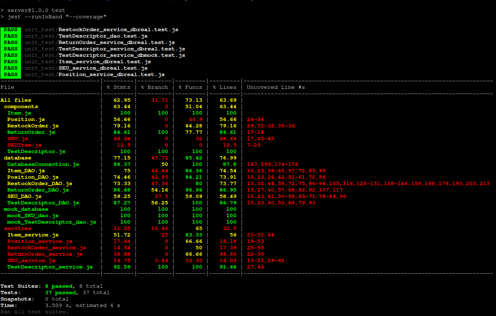

# Unit Testing Report

Date:

Version:

# Contents

- [Black Box Unit Tests](#black-box-unit-tests)

- [White Box Unit Tests](#white-box-unit-tests)

# Black Box Unit Tests

    <Define here criteria, predicates and the combination of predicates for each function of each class.
    Define test cases to cover all equivalence classes and boundary conditions.
    In the table, report the description of the black box test case and (traceability) the correspondence with the Jest test case writing the 
    class and method name that contains the test case>
    <Jest tests  must be in code/server/unit_test  >

### **Class services/SKU_service.js - method getSKUById**

**Criteria for method getSKUById:**

 -  ID sign

**Predicates for method getSKUById:**

| Criteria | Predicate |
| -------- | --------- |
| ID sign | > 0 |
|         | < 0 |

**Boundaries**:

| Criteria | Boundary values |
| -------- | --------------- |
| ID sign | ID == 0 |

**Combination of predicates**:

| ID sign | Valid / Invalid | Description of the test case | Jest test case |
|-------|-------|-------|-------|
|> 0| Valid | Try to get a SKU with a positive id | get SKU |
|< 0| Invalid | Try to get a SKU with a negative id | get SKU |
|= 0| Invalid | Try to get a SKU with a id == 0 | get SKU |

### **Class services/SKU_service.js - method createSKU**

**Criteria for method createSKU:**

 - Weight sign 
 - Volume sign 
 - Price sign
 - Quantity sign

**Predicates for method createSKU:**

| Criteria | Predicate |
| -------- | --------- |
| Weight sign | > 0 |
|             | < 0 |
| Volume sign | > 0 |
|             | < 0 |
| Price sign | > 0 |
|            | < 0 |
| Quantity sign | > 0 |
|               | < 0 |

**Boundaries**:

| Criteria | Boundary values |
| -------- | --------------- |
| Weight sign | = 0 |
| Volume sign | = 0 |
| Price sign | = 0 |
| Quantity sign | = 0 |

**Combination of predicates**:

| Weight sign | Volume sign | Price sign | Quantity sign | Valid / Invalid | Jest test case |
|-------|-------|-------|-------|-------|-------|
| > 0| > 0 | > 0 | > 0 | Valid | new SKU |
|    | = 0 | > 0 | > 0 | Valid | new SKU |
|    |     | = 0 | > 0 | Valid | new SKU |
|    |     |     | = 0 | Valid | new SKU |
|    |     |     | < 0 | Invalid | new SKU |
|    |     | < 0 | > 0 | Invalid | new SKU |
|    |     |     | = 0 | Invalid | new SKU |

### **Class services/SKU_services.js - method updateSKU**

**Criteria for method updateSKUItem:**

 - ID sign

**Predicates for method updateSKUItem:**

| Criteria | Predicate |
| -------- | --------- |
| ID sign | > 0 |
|           | < 0 |

**Boundaries**:

| Criteria | Boundary values |
| -------- | --------------- |
| ID sign | = 0 |

**Combination of predicates**:

| ID sign | Valid / Invalid | Description | Jest test case |
|-------|-------|-------|-------|-------|
| > 0 | Valid |   update a SKU with positive ID | update SKU |
| < 0 | Invalid | update a SKU with negative ID | update SKU |
| = 0 |  Invalid | update a SKU with zero ID | update SKU |

### **Class services/SKU_service.js - method deleteSKU**

**Criteria for method deleteSKU:**

 - ID sign

**Predicates for method deleteSKU:**

| Criteria | Predicate |
| -------- | --------- |
| ID sign | > 0 |
|         | < 0 |

**Boundaries**:

| Criteria | Boundary values |
| -------- | --------------- |
| ID sign | = 0 |

**Combination of predicates**:

| ID sign | Valid / Invalid | Description of the test case | Jest test case |
|-------|-------|-------|-------|
|> 0| Valid | delete a SKU with a positive id| delete SKU |
|< 0| Invalid | Try to get a SKU with a negative id| delete SKU |
|= 0| Invalid | Try to get a SKU with a id == 0| delete SKU |

### **Class services/SKUItem_service.js - method getSKUItemsBySKUID**

**Criteria for method getSKUItemsBySKUID:**

 -  SKUID sign

**Predicates for method getSKUItemsBySKUID:**

| Criteria | Predicate |
| -------- | --------- |
| SKUID sign | > 0 |
|            | < 0 |

**Boundaries**:

| Criteria | Boundary values |
| -------- | --------------- |
| SKUID sign | ID == 0 |

**Combination of predicates**:

| skuid sign | Valid / Invalid | Description of the test case | Jest test case |
|-------|-------|-------|-------|
|> 0| Valid | Try to get a SKUItem with a positive id| get SKU Item |
|< 0| Invalid | Try to get a SKUItem with a negative id| get SKU Item |
|= 0| Invalid | Try to get a SKUItem with a id == 0| get SKU Item |

### **Class services/SKUItem_service.js - method getSKUItemByRFID**

**Criteria for method getSKUItemByRFID:**

 -  RFID sign

**Predicates for method getSKUItemByRFID:**

| Criteria | Predicate |
| -------- | --------- |
| RFID sign | > 0 |
|         | < 0 |

**Boundaries**:

| Criteria | Boundary values |
| -------- | --------------- |
| RFID sign | RFID == 0 |

**Combination of predicates**:

| RFID sign | Valid / Invalid | Description of the test case | Jest test case |
|-------|-------|-------|-------|
|> 0| Valid | Try to get a SKUItem with a positive RFID| get SKU Item |
|< 0| Invalid | Try to get a SKUItem with a negative RFID| get SKU Item |
|= 0| Invalid | Try to get a SKUItem with a RFID == 0| get SKU Item |

### **Class services/SKUItem.js - method createSKUItem**

**Criteria for method insertNewSKUItem:**

 - RFID sign
 - SKUID sign

**Predicates for method insertNewSKUItem:**

| Criteria | Predicate |
| -------- | --------- |
| SKUItemID sign | > 0 |
|          | < 0 |
| RFID sign | > 0 |
|            | < 0 |

**Boundaries**:

| Criteria | Boundary values |
| -------- | --------------- |
| SKUItemID sign | = 0 |
| RFID sign | = 0 |

**Combination of predicates**:

| SKUItemID sign | RFID sign | Valid / Invalid | Description | Jest test case |
|-------|-------|-------|-------|-------|
| > 0 | > 0 | Valid   | insert a SKUItem with positive id, positive RFID | new SKU Item |
| > 0 | < 0 | Invalid | insert a SKUItem with positive id, negative RFID | new SKU Item |
| > 0 | < 0 | Invalid | insert a SKUItem with positive id, negative RFID | new SKU Item |
| > 0 | = 0 | Invalid | insert a SKUItem with positive id, Zero RFID | new SKU Item |
| < 0 | > 0 |  Invalid | insert a SKUItem with a negative id, positive RFID | new SKU Item|
| < 0 | = 0 | Invalid | insert a SKUItem with a negative id, Zero RFID | new SKU Item |
| = 0 | > 0 | = 0 | Invalid | insert a SKUItem with a Zero id, positive RFID | new SKU Item |
| = 0 | < 0 | Invalid | insert a SKUItem with a Zero id, negative RFID | new SKU Item |
| = 0 | = 0 | Invalid | insert a SKUItem with a Zero id, Zero RFID | new SKU Item |

### **Class services/SKUItem_services.js - method updateSKUItem**

**Criteria for method updateSKUItem:**

 - RFID sign

**Predicates for method updateSKUItem:**

| Criteria | Predicate |
| -------- | --------- |
| RFID sign | > 0 |
|           | < 0 |

**Boundaries**:

| Criteria | Boundary values |
| -------- | --------------- |
| RFID sign | = 0 |

**Combination of predicates**:

| RFID sign | Valid / Invalid | Description | Jest test case |
|-------|-------|-------|-------|-------|
| > 0 | Valid |   update a SKUItem with positive RFID | update SKU Item |
| < 0 | Invalid | update a SKUItem with negative RFID | update SKU Item |
| = 0 |  Invalid | update a SKUItem with zero RFID | update SKU Item |

### **Class services/services/SKUItem_services.js - method deleteSKUItem**

**Criteria for method deleteSKUItem:**

 -  rfid sign

**Predicates for method deleteSKUItem:**

| Criteria | Predicate |
| -------- | --------- |
| rfid sign | > 0 |
|         | < 0 |

**Boundaries**:

| Criteria | Boundary values |
| -------- | --------------- |
| rfid sign | = 0 |

**Combination of predicates**:

| SKUItem ID sign | Valid / Invalid | Description of the test case | Jest test case |
|-------|-------|-------|-------|
|> 0| Valid | delete a SKUItem with a positive id| delete SKU Item|
|< 0| Invalid | Try to get a SKU with a negative id| delete SKU Item|
|= 0| Invalid | Try to get a SKU with a id == 0| delete SKU Item|

### **Class services/Position_services.js - method getPositionById**

### **Class  services/Position_services.js - method updatePosition**

**Criteria for method updatePosition:**
 
 - aisle id	sign
 - row sign
 - col sign

**Predicates for method updatePosition:**

| Criteria | Predicate |
| -------- | --------- |
| aisle id sign | > 0 |
|          | < 0 |
| row sign | > 0 |
|          | < 0 |
| col sign | > 0 |
|          | < 0 |

**Boundaries**:

| Criteria | Boundary values |
| -------- | --------------- |
|  aisle id sign   | = 0 |
|  row sign   | = 0 |
|  col sign   | = 0 |

**Combination of predicates**:

| aisle id sign | row sign | col sign | Valid / Invalid | Description of the test case | Jest test case |
|-------|-------|-------|-------|-------|-------|
| > 0 | > 0 | > 0 | Valid   | update a position with positive aisle id, positive row id, positive column id | update Position |
| > 0 | > 0 | < 0 | Invalid | update a position with positive aisle id, positive row id, negative column id | update Position |
| > 0 | > 0 | = 0 | Invalid | update a position with positive aisle id, positive row id, zero column id | update Position |
| > 0 | < 0 | > 0 | Invalid | update a position with positive aisle id, negative row id, positive column id | update Position |
| > 0 | < 0 | < 0 | Invalid | update a position with positive aisle id, negative row id, negative column id | update Position|
| > 0 | < 0 | = 0 | Invalid | update a position with positive aisle id, negative row id, zero column id     | update Position|
| > 0 | = 0 | > 0 | Invalid | update a position with positive aisle id, zero row id, positive column id     | update Position |
| > 0 | = 0 | < 0 | Invalid | update a position with positive aisle id, zero row id, negative column id     | update Position |
| > 0 | = 0 | = 0 | Invalid | update a position with positive aisle id, zero row id, zero column id         | update Position |
| < 0 | > 0 | > 0 | Invalid | update a Position with a negative aisle id, positive row id, positive column id | update Position |
| < 0 | > 0 | < 0 | Invalid | update a Position with a negative aisle id, positive row id, negative column id | update Position |
| < 0 | > 0 | = 0 | Invalid | update a Position with a negative aisle id, positive row id, zero column id     | update Position |
| < 0 | < 0 | > 0 | Invalid | update a Position with a negative aisle id, negative row id, positive column id | update Position |
| < 0 | < 0 | < 0 | Invalid | update a Position with a negative aisle id, negative row id, negative column id | update Position |
| < 0 | < 0 | = 0 | Invalid | update a Position with a negative aisle id, negative row id, zero column id     | update Position |
| < 0 | = 0 | > 0 | Invalid | update a Position with a negative aisle id, zero row id, positive column id     | update Position |
| < 0 | = 0 | < 0 | Invalid | update a Position with a negative aisle id, zero row id, negative column id     | update Position |
| < 0 | = 0 | = 0 | Invalid | update a Position with a negative aisle id, zero row id, zero column id         | update Position |
| = 0 | > 0 | > 0 | Invalid | update a Position with a zero aisle id, positive row id, positive column id  | update Position |
| = 0 | > 0 | < 0 | Invalid | update a Position with a zero aisle id, positive row id, negative column id  | update Position |
| = 0 | > 0 | = 0 | Invalid | update a Position with a zero aisle id, positive row id, zero column id      | update Position |
| = 0 | < 0 | > 0 | Invalid | update a Position with a zero aisle id, negative row id, positive column id  | update Position |
| = 0 | < 0 | < 0 | Invalid | update a Position with a zero aisle id, negative row id, negative column id  | update Position |
| = 0 | < 0 | = 0 | Invalid | update a Position with a zero aisle id, negative row id, zero column id   | update Position|
| = 0 | = 0 | > 0 | Invalid | update a Position with a zero aisle id, zero row id, positive column id      | update Position |
| = 0 | = 0 | < 0 | Invalid | update a Position with a zero aisle id, zero row id, negative column id      | update Position |
| = 0 | = 0 | = 0 | Invalid | update a Position with a zero aisle id, zero row id, zero column id | update Position|

### **Class  services/Position_services.js - method insertNewPosition**

**Criteria for method insertNewPosition:**

 - positionID sign
 - maxWeight sign
 - maxVolume sign

**Predicates for method insertNewPosition:**

| Criteria | Predicate |
| -------- | --------- |
| positionID sign | > 0 |
|          | < 0 |
| maxWeight sign | > 0 |
|            | < 0 |
| maxVolume sign | > 0 |
|            | < 0 |

**Boundaries**:

| Criteria | Boundary values |
| -------- | --------------- |
| positionID sign | = 0 |
| maxWeight sign | = 0 |
| maxVolume sign | = 0 |

**Combination of predicates**:

| positionID sign | maxWeight sign | maxVolume sign | Valid / Invalid | Description | Jest test case |
|-------|-------|-------|-------|-------|-------|
| > 0 | > 0 | > 0 | Valid   | insert a position with positive id, positive maxWeight, positive maxVolume | new Position |
| > 0 | > 0 | < 0 | Invalid | insert a position with positive id, positive maxWeight, negative maxVolume | new Position |
| > 0 | > 0 | = 0 | Invalid | insert a position with positive id, positive maxWeight, Zero maxVolume     | new Position |
| > 0 | < 0 | > 0 | Invalid | insert a position with positive id, negative maxWeight, positive maxVolume | new Position |
| > 0 | < 0 | < 0 | Invalid | insert a position with positive id, negative maxWeight, negative maxVolume | new Position |
| > 0 | < 0 | = 0 | Invalid | insert a position with positive id, negative maxWeight, Zero maxVolume     | new Position     |
| > 0 | = 0 | > 0 | Invalid | insert a position with positive id, Zero maxWeight, positive maxVolume     | new Position|
| > 0 | = 0 | < 0 | Invalid | insert a position with positive id, Zero maxWeight, negative maxVolume     | new Position|
| > 0 | = 0 | = 0 | Invalid | insert a position with positive id, Zero maxWeight, Zero maxVolume         | new Position |
| < 0 | > 0 | > 0 | Invalid | insert a Position with a negative id, positive maxWeight, positive maxVolume | new Position |
| < 0 | > 0 | < 0 | Invalid | insert a Position with a negative id, positive maxWeight, negative maxVolume | new Position |
| < 0 | > 0 | = 0 | Invalid | insert a Position with a negative id, positive maxWeight, Zero maxVolume     | new Position |
| < 0 | < 0 | > 0 | Invalid | insert a Position with a negative id, negative maxWeight, positive maxVolume | new Position |
| < 0 | < 0 | < 0 | Invalid | insert a Position with a negative id, negative maxWeight, negative maxVolume | new Position |
| < 0 | < 0 | = 0 | Invalid | insert a Position with a negative id, negative maxWeight, Zero maxVolume     | new Position |
| < 0 | = 0 | > 0 | Invalid | insert a Position with a negative id, Zero maxWeight, positive maxVolume     | new Position |
| < 0 | = 0 | < 0 | Invalid | insert a Position with a negative id, Zero maxWeight, negative maxVolume     | new Position |
| < 0 | = 0 | = 0 | Invalid | insert a Position with a negative id, Zero maxWeight, Zero maxVolume         | new Position |
| = 0 | > 0 | > 0 | Invalid | insert a Position with a Zero id, positive maxWeight, positive maxVolume  | new Position |
| = 0 | > 0 | < 0 | Invalid | insert a Position with a Zero id, positive maxWeight, negative maxVolume  | new Position |
| = 0 | > 0 | = 0 | Invalid | insert a Position with a Zero id, positive maxWeight, Zero maxVolume      | new Position |
| = 0 | < 0 | > 0 | Invalid | insert a Position with a Zero id, negative maxWeight, positive maxVolume  | new Position |
| = 0 | < 0 | < 0 | Invalid | insert a Position with a Zero id, negative maxWeight, negative maxVolume  | new Position |
| = 0 | < 0 | = 0 | Invalid | insert a Position with a Zero id, negative maxWeight, Zero maxVolume      | new Position |
| = 0 | = 0 | > 0 | Invalid | insert a Position with a Zero id, Zero maxWeight, positive maxVolume      | new Position |
| = 0 | = 0 | < 0 | Invalid | insert a Position with a Zero id, Zero maxWeight, negative maxVolume      | new Position |
| = 0 | = 0 | = 0 | Invalid | insert a Position with a Zero id, Zero maxWeight, Zero maxVolume          | new Position |

### **Class  services/Position_services.js - method deletePosition**

**Criteria for method deletePosition:**

 -  position ID sign

**Predicates for method deletePosition:**

| Criteria | Predicate |
| -------- | --------- |
| position ID sign | > 0 |
|         | < 0 |

**Boundaries**:

| Criteria | Boundary values |
| -------- | --------------- |
| position ID sign | = 0 |

**Combination of predicates**:

| position ID sign | Valid / Invalid | Description of the test case | Jest test case |
|-------|-------|-------|-------|
|> 0| Valid | delete a position with a positive id| delete Position |
|< 0| Invalid | Try to get a SKU with a negative id| delete Position |
|= 0| Invalid | Try to get a SKU with a id == 0| delete Position |

### **Class services/TestDescriptor_service.js - method getTestDescriptorById**

**Criteria for method getTestDescriptorById:**

 -  ID sign

**Predicates for method getTestDescriptorById:**

| Criteria | Predicate |
| -------- | --------- |
| ID sign | > 0 |
|         | < 0 |

**Boundaries**:

| Criteria | Boundary values |
| -------- | --------------- |
| ID sign | ID == 0 |

**Combination of predicates**:

| ID sign | Valid / Invalid | Description of the test case | Jest test case |
|-------|-------|-------|-------|
|> 0| Valid | Try to get a TestDescriptor with a positive id| get Test Descriptor |
|< 0| Invalid | Try to get a TestDescriptor with a negative id|get Test Descriptor |
|= 0| Invalid | Try to get a TestDescriptor with a id == 0| get Test Descriptor |

### **Class services/TestDescriptor_service.js - method createTestDescriptor**

**Criteria for method createTestDescriptor:**

 - name chracter
 - idSKU sign

**Predicates for method createTestDescriptor:**

| Criteria | Predicate |
| -------- | --------- |
| name characters | > 0 |
|          | < 0 |
| idSKU sign | > 0 |
|            | < 0 |

**Boundaries**:

| Criteria | Boundary values |
| -------- | --------------- |
| name character  | = 0 |
| idSKU sign | = 0 |

**Combination of predicates**:

| name character | idSKU sign | Valid / Invalid | Jest test case |
|-------|-------|-------|-------|
| > 0| > 0 | Valid | new TestDescriptor |
| = 0| > 0 | Invalid | new TestDescriptor |
| > 0| = 0 | Invalid |new TestDescriptor |

### **Class services/TestDescriptor_service.js - method updateTestDescriptor**

 **Criteria for method updateTestDescriptor:**

 - newName chracter
 - newIdSKU sign

**Predicates for method updateTestDescriptor:**

| Criteria | Predicate |
| -------- | --------- |
| newName characters  | > 0 |
|          | < 0 |
| newIdSKU sign | > 0 |
|            | < 0 |

**Boundaries**:

| Criteria | Boundary values |
| -------- | --------------- |
| newName character  | = 0 |
| newIdSKU sign | = 0 |

**Combination of predicates**:

| newName character  | newIdSKU sign | Valid / Invalid | Jest test case |
|-------|-------|-------|-------|
| > 0| > 0 | Valid | update TestDescriptor |
| = 0| > 0 | Invalid | update TestDescriptor |
| > 0| = 0 | Invalid | update TestDescriptor |

### **Class services/TestDescriptor_service.js - method deleteTestDescriptor

**Criteria for method deleteTestDescriptor:**

 - id sign

**Predicates for method deleteTestDescriptor:**

| Criteria | Predicate |
| -------- | --------- |
| id sign | > 0 |
|          | < 0 |

**Boundaries**:

| Criteria | Boundary values |
| -------- | --------------- |
| id sign | = 0 |

**Combination of predicates**:

| ID sign | Valid / Invalid | Description of the test case | Jest test case |
|-------|-------|-------|-------|
|> 0| Valid | Try to get a id with a positive id| delete TestDescriptor |
|< 0| Invalid | Try to get a id with a negative id| delete TestDescriptor|
|= 0| Invalid | Try to get a id with a id == 0|delete TestDescriptor |

### **Class services/TestResult_service.js - method getTestResults**

**Criteria for method getTestResults:**

 -  rfid sign

**Predicates for method getTestResults:**

| Criteria | Predicate |
| -------- | --------- |
| rfid sign | > 0 |
|           | < 0 |

**Boundaries**:

| Criteria | Boundary values |
| -------- | --------------- |
| rfid sign | rfid == 0 |

**Combination of predicates**:

| ID sign | Valid / Invalid | Description of the test case | Jest test case |
|-------|-------|-------|-------|
|> 0| Valid | Try to get a TestResult with a positive rfid| get Test Descriptor |
|< 0| Valid | Try to get a TestResult with a negative rfid|get Test Descriptor|
|= 0| Invalid | Try to get a TestResult with a rfid == 0|get Test Descriptor|

### **Class services/TestResult_service.js - method getTestResultByID**

**Criteria for method getTestResultByID:**

 -  id sign
 -  rfid character

**Predicates for method getTestResultByID:**

| Criteria | Predicate |
| -------- | --------- |
| rfid sign  | > 0 |
|          | < 0 |
| id sign | > 0 |
|            | < 0 |

**Boundaries**:

| Criteria | Boundary values |
| -------- | --------------- |
| id sign | ID == 0 |

**Combination of predicates**:

| rfid sign  | id sign | Valid / Invalid | Jest test case |
|-------|-------|-------|-------|
| > 0| > 0 | Valid | get Test Descriptor |
| = 0| > 0 | Invalid |get Test Descriptor |
|    | = 0 | Invalid |get Test Descriptor |
|    | < 0 | Invalid |get Test Descriptor |

### **Class services/TestResult_service.js - method createTestResult**

**Criteria for method createTestResult:**

 -  idTestDescriptor sign
 -  rfid sign
 -  Date
 -  Result

**Predicates for method createTestResult:**

| Criteria | Predicate |
| -------- | --------- |
| idTestDescriptor  sign | > 0 |
|          | < 0 |
| rfid sign | > 0 |
|            | < 0 |
| Date sign | > 0 |
|          | < 0 |
| Result sign | Y |
|            | N |

**Boundaries**:

| Criteria | Boundary values |
| -------- | --------------- |
| idTestDescriptor sign | = 0 |
| rfid  sign | = 0 |
| Date sign | = 0 |

**Combination of predicates**:

| idTestDescriptor sign | rfid sign | Date sign | Result sign | Valid / Invalid | Jest test case |
|-------|-------|-------|-------|-------|-------|
| > 0| > 0 | > 0 | > 0 | Valid | new Test Result |
| = 0| > 0 | > 0 | > 0 | Invalid | new Test Result |
|    | = 0 | > 0 | > 0 | Invalid | new Test Result |
|    |     | = 0 | > 0 | Valid | new Test Result |
|    |     | < 0 | > 0 | Invalid | new Test Result |
|    |     |     | > 0 | Valid | new Test Result |
|    |     |     | < 0 | Invalid | new Test Result |

### **Class services/TestResult_service.js - method updateTestResult**

**Criteria for method updateTestResult:**

 -  id sign
 -  rfid sign
 -  newDate
 -  newResult

**Predicates for method updateTestResult:**

| Criteria | Predicate |
| -------- | --------- |
| id  sign | > 0 |
|          | < 0 |
| rfid sign | > 0 |
|            | < 0 |
| newDate sign | > 0 |
|          | < 0 |
| newResult sign | Y |
|            | N |

**Boundaries**:

| Criteria | Boundary values |
| -------- | --------------- |
| id sign | = 0 |
| rfid  sign | = 0 |
| newDate sign | = 0 |

**Combination of predicates**:

| id sign | rfid sign | newDate sign | result sign | Valid / Invalid | Jest test case |
|-------|-------|-------|-------|-------|-------|
| > 0| > 0 | > 0 | > 0 | Valid | update Test Result |
| = 0| > 0 | > 0 | > 0 | Invalid | update Test Result |
|    | < 0 | > 0 | > 0 | Valid | update Test Result |
|    | = 0 | > 0 | > 0 | Invalid | update Test Result |
|    |     | = 0 | > 0 | Valid | update Test Result |
|    |     | < 0 | > 0 | Invalid | update Test Result |
|    |     |     | > 0 | Valid | update Test Result |
|    |     |     | < 0 | Invalid | update Test Result |

### **Class services/TestResult_service.js - method deleteTestResult**

**Criteria for method deleteTestResult:**
 
 -  rfid sign
 -  id sign

**Predicates for method deleteTestResult:**

| Criteria | Predicate |
| -------- | --------- |
| id  sign | > 0 |
|          | < 0 |
| rfid sign | > 0 |
|            | < 0 |

**Boundaries**:

| Criteria | Boundary values |
| -------- | --------------- |
| id sign | ID == 0 |

**Combination of predicates**:

| rfid character  | id sign | Valid / Invalid | Jest test case |
|-------|-------|-------|-------|
| > 0| > 0 | Valid | delete TestDescriptor |
| = 0| > 0 | Invalid | delete TestDescriptor |
|    | = 0 | Invalid | delete TestDescriptor |
|    | < 0 | Invalid | delete TestDescriptor |

### **Class services/Item_services.js - method selectItemByID**

**Criteria for method selectItemByID:**

 -  ID sign

**Predicates for method selectItemByID:**

| Criteria | Predicate |
| -------- | --------- |
| ID sign | > 0 |
|         | < 0 |

**Boundaries**:

| Criteria | Boundary values |
| -------- | --------------- |
| ID sign | ID == 0 |

**Combination of predicates**:

| ID sign | Valid / Invalid | Description of the test case | Jest test case |
|-------|-------|-------|-------|
|> 0| Valid | Try to get a Item with a positive id| get Items|
|< 0| Invalid | Try to get a Item with a negative id|get Items|
|= 0| Invalid | Try to get a Item with a id == 0| get Items |

### **Class services/Item_services.js - method createItem**

**Criteria for method createItem:**

 - Id sign
 - Price sign 
 - skuid sign
 - supplierId sign

**Predicates for method createItem:**

| Criteria | Predicate |
| -------- | --------- |
| id sign | > 0 |
|          | < 0 |
| Price sign | > 0 |
|             | < 0 |
| skuid sign | > 0 |
|            | < 0 |
| supplierId sign | > 0 |
|                 | < 0 |

**Boundaries**:

| Criteria | Boundary values |
| -------- | --------------- |
| id sign | = 0 |
| Price sign | = 0 |
| skuid sign | = 0 |
| supplierId sign | = 0 |

**Combination of predicates**:
//Price would be zero in the cases where the item has an difect and sending item again which doesnt has diffect. 

| id sign | Price sign | skuid sign | supplierId sign | Valid / Invalid | Jest test case |
|-------|-------|-------|-------|-------|-------|
| > 0| > 0 | > 0 | > 0 | Valid | new Item |
| > 0| = 0 | > 0 | > 0 | Valid | new Item |
|    |     | = 0 | > 0 | Invalid | new Item |
|    |     |     | = 0 | Invalid | new Item |

### **Class services/Item_services.js - method updateItem**

**Criteria for method updateItem:**

 - Id sign
 - Price sign 
 

**Predicates for method updateItem:**

| Criteria | Predicate |
| -------- | --------- |
| id sign | > 0 |
|          | < 0 |
| Price sign | > 0 |
|             | < 0 |

**Boundaries**:

| Criteria | Boundary values |
| -------- | --------------- |
| id sign | = 0 |
| Price sign | = 0 |

**Combination of predicates**:
//Price would be zero in the cases where the item has an difect and sending item again which doesnt has diffect. 

| Price sign | id sign | Valid / Invalid | Jest test case |
|-------|-------|-------|-------|
| > 0 | > 0 | Valid | update Item |
| = 0 | > 0 | Valid | update Item |
|     | = 0 | Invalid | update Item |

### **Class services/Item_services.js - method deleteItem**

**Criteria for method deleteItem:**

 - Id sign

**Predicates for method deleteItem:**

| Criteria | Predicate |
| -------- | --------- |
| id sign | > 0 |
|          | < 0 |

**Boundaries**:

| Criteria | Boundary values |
| -------- | --------------- |
| id sign | = 0 |

**Combination of predicates**:

| ID sign | Valid / Invalid | Description of the test case | Jest test case |
|-------|-------|-------|-------|
|> 0| Valid | Try to get a id with a positive id| delete Item|
|< 0| Invalid | Try to get a id with a negative id|delete Item|
|= 0| Invalid | Try to get a id with a id == 0|delete Item|

### **Class services/RestockOrder.js - method getRestockOrderById**

**Criteria for method getRestockOrderById:**

 -  id sign

**Predicates for method getRestockOrderById:**

| Criteria | Predicate |
| -------- | --------- |
| id sign | > 0 |
|         | < 0 |

**Boundaries**:

| Criteria | Boundary values |
| -------- | --------------- |
| id sign | ID == 0 |

**Combination of predicates**:

| id sign | Valid / Invalid | Description of the test case | Jest test case |
|-------|-------|-------|-------|
|> 0| Valid | Try to get a TransportNoteById with a positive id| get RestockOrder|
|< 0| Invalid | Try to get a TransportNoteById with a negative id|get RestockOrder|
|= 0| Invalid | Try to get a TransportNoteById with a id == 0|get RestockOrder|

### **Class services/RestockOrder.js - method createRestockOrder**

**Criteria for method createRestockOrder:**

 - issueDate sign
 - supplierId sign

**Predicates for method createRestockOrder:**

| Criteria | Predicate |
| -------- | --------- |
| supplierId sign | > 0 |
|          | < 0 |
| issueDate sign | > 0 |
|             | < 0 |

**Boundaries**:

| Criteria | Boundary values |
| -------- | --------------- |
| supplierId sign | = 0 |
| issueDate sign | = 0 |

**Combination of predicates**:

| supplierId sign | issueDate sign | Valid / Invalid | Jest test case |
|-------|-------|-------|-------|-------|
| > 0 | > 0 | Valid | new RestockOrder |
|     | > 0 | Valid | new RestockOrder |

### **Class services/RestockOrder.js - method updateRestockOrderTransportNote**

**Criteria for method updateRestockOrderTransportNote:**

 - deliveryDate sign

**Predicates for method updateRestockOrderTransportNote:**

| Criteria | Predicate |
| -------- | --------- |
| deliveryDate sign | > 0 |
|          | < 0 |

**Boundaries**:

| Criteria | Boundary values |
| -------- | --------------- |
| deliveryDate sign sign | = 0 |

**Combination of predicates**:

| id sign | Valid / Invalid | Jest test case |
|-------|-------|-------|-------|-------|-------|
| > 0| Valid | update RestockOrder transport note |
| = 0| Invalid | update RestockOrder transport note |

### **Class services/RestockOrder.js - method updateRestockOrderState**

**Criteria for method updateRestockOrderState:**

 - id sign
 - newState sign

**Predicates for method updateRestockOrderState:**

| Criteria | Predicate |
| -------- | --------- |
| id sign | > 0 |
|             | < 0 |
| newState sign | > 0 |
|            | < 0 |

**Boundaries**:

| Criteria | Boundary values |
| -------- | --------------- |
| id sign | = 0 |
| newState sign | = 0 |

**Combination of predicates**:
//Price would be zero in the cases where the item has an difect and sending item again which doesnt has diffect. 

| id sign | newState sign | Valid / Invalid | Jest test case |
|-------|-------|-------|-------|-------|
| > 0 | > 0 | Valid | update RestockOrder state |
|     | > 0 | Invalid | update RestockOrder state |
|     |     | Invalid | update RestockOrder state |

### **Class services/RestockOrder.js - method deleteRestockOrder**

**Criteria for method deleteRestockOrder:**

 -  id sign

**Predicates for method deleteRestockOrder:**

| Criteria | Predicate |
| -------- | --------- |
| id sign | > 0 |
|         | < 0 |

**Boundaries**:

| Criteria | Boundary values |
| -------- | --------------- |
| id sign | ID == 0 |

**Combination of predicates**:

| id sign | Valid / Invalid | Description of the test case | Jest test case |
|-------|-------|-------|-------|
|> 0| Valid | Try to get a RestockOrderById with a positive id| delete RestockOrder|
|< 0| Invalid | Try to get a RestockOrderById with a negative id|delete RestockOrder|
|= 0| Invalid | Try to get a RestockOrderById with a id == 0|delete RestockOrder|

### **Class services/User_service.js - method createUser**

**Criteria for method createUser:**

 - name char
 - surname char
 - email char
 - type char
 - password sign
 

**Predicates for method createUser:**

| Criteria | Predicate |
| -------- | --------- |
| name char | > 0 |
|          | < 0 |
| surname char | > 0 |
|             | < 0 |
| email char | > 0 |
|            | < 0 |
| type char | > 0 |
|            | < 0 |
| password sign | > 0 |
|            | < 0 |

**Boundaries**:

| Criteria | Boundary values |
| -------- | --------------- |
| name char | = 0 |
| surname char | = 0 |
| email char | = 0 |
| type char | = 0 |
| password sign | = 0 |

**Combination of predicates**:

| name char | surname char | email char | type char | password | Valid / Invalid | Jest test case |
|-------|-------|-------|-------|-------|
| > 0 | > 0 | > 0 | > 0 | > 0 | > 0 | Valid | new User |
| < 0 | > 0 | > 0 | > 0 | > 0 | > 0 | Valid | new User |
| > 0 | < 0 | > 0 | > 0 | > 0 | > 0 | Valid | new User |
| > 0 | > 0 | < 0 | > 0 | > 0 | > 0 | Valid | new User |
| > 0 | > 0 | > 0 | < 0 | > 0 | > 0 | Valid | new User |
| > 0 | > 0 | > 0 | > 0 | = 0 | > 0 | Valid | new User|
| > 0 | > 0 | > 0 | > 0 | > 0 | = 0 | Valid | new User |
| > 0 | > 0 | > 0 | > 0 | > 0 | < 0 | Invalid | new User |
| > 0 | > 0 | > 0 | > 0 | = 0 |     | Invalid | new User |
| > 0 | > 0 | > 0 | = 0 |     |     | Invalid | new User |
| > 0 | > 0 | = 0 |     |     |     | Invalid | new User |
| > 0 | = 0 |     |     |     |     | Invalid | new User |
| = 0 |     |     |     |     |     | Invalid | new User|

### **Class services/User_service.js - method updateUserRights**

**Criteria for method updateUserRights:**
-  email char
-  type char

**Predicates for method updateUserRights:**

| Criteria | Predicate |
| -------- | --------- |
| email char | > 0 |
|        | < 0 |
| type char | > 0 |
|        | < 0 |

**Boundaries**:

| Criteria | Boundary values |
| -------- | --------------- |
| email char | ID == 0 |
| type char | ID == 0 |

**Combination of predicates**:

| email char | type char | Valid / Invalid | Description of the test case | Jest test case |
|-------|-------|-------|-------|
|> 0 | > 0 | Valid   | update User |
|< 0 | > 0 | Valid   | update User |
|> 0 | < 0 | Valid   | update User |
|= 0 | > 0 | Invalid | update User |
|    | = 0 | Invalid | update User |

## **Class services/User_service.js - method deleteUser**

**Criteria for method deleteUser:**
-  email char
-  type char

**Predicates for method deleteUser:**

| Criteria | Predicate |
| -------- | --------- |
| email char | > 0 |
|        | < 0 |
| type char | > 0 |
|        | < 0 |

**Boundaries**:

| Criteria | Boundary values |
| -------- | --------------- |
| email char | ID == 0 |
| type char | ID == 0 |

**Combination of predicates**:

| email char | type char | Valid / Invalid | Description of the test case | Jest test case |
|-------|-------|-------|-------|
|> 0 | > 0 | Valid   | delete User |
|< 0 | > 0 | Valid   | delete User |
|> 0 | < 0 | Valid   | delete User |
|= 0 | > 0 | Invalid | delete User |
|    | = 0 | Invalid | delete User |

### **Class services/ReturnOrder_service.js - method getReturnOrderByID**

**Criteria for method getReturnOrderByID:**

 -  id sign

**Predicates for method getReturnOrderByID:**

| Criteria | Predicate |
| -------- | --------- |
| id sign | > 0 |
|         | < 0 |

**Boundaries**:

| Criteria | Boundary values |
| -------- | --------------- |
| id sign | ID == 0 |

**Combination of predicates**:

| id sign | Valid / Invalid | Description of the test case | Jest test case |
|-------|-------|-------|-------|
|> 0| Valid | Try to get a Return Order By Id with a positive id| get Return Order|
|< 0| Invalid | Try to get a Return Order By Id with a negative id|get Return Order|
|= 0| Invalid | Try to get a Return Order By Id with a id == 0|get Return Order|

### **Class services/ReturnOrder_service.js - method newReturnOrder**

**Criteria for method newReturnOrder:**

 -  restockOrderId sign
 - returnDate Date

**Predicates for method newReturnOrder:**

| Criteria | Predicate |
| -------- | --------- |
| restockOrderId sign | > 0 |
|         | < 0 |
| returnDate.isDate() | Y |
| returnDate.isDate() | N |

**Boundaries**:

| Criteria | Boundary values |
| -------- | --------------- |
| restockOrderId sign | ID == 0 |

**Combination of predicates**:

| restockOrderId sign | returnDate Date | Valid / Invalid | Description of the test case | Jest test case |
|-------|-------|-------|-------|--------|
|> 0| Y |Valid | Try to create a Return Order By Id with a positive id| new Return Order|
|< 0| N |Invalid | Try to create a Return Order By Id with a negative id|new Return Order|
|= 0| Y |Invalid | Try to create a Return Order By Id with a id == 0 |new Return Order|
|> 0| N |Invalid | Try to create a Return Order with an invalid date |new Return Order|

### **Class services/ReturnOrder_service.js - method deleteReturnOrder**

**Criteria for method deleteReturnOrder:**

 -  id sign

**Predicates for method deleteReturnOrder:**

| Criteria | Predicate |
| -------- | --------- |
| id sign | > 0 |
|         | < 0 |

**Boundaries**:

| Criteria | Boundary values |
| -------- | --------------- |
| id sign | ID == 0 |

**Combination of predicates**:

| id sign | Valid / Invalid | Description of the test case | Jest test case |
|-------|-------|-------|-------|
|> 0| Valid | Try to delete a Return Order By Id with a positive id| delete Return Order|
|< 0| Invalid | Try to delete a Return Order By Id with a negative id|delete Return Order|
|= 0| Invalid | Try to delete a Return Order By Id with a id == 0|delete Return Order|

### **Class services/ReturnOrder_service.js - method getInternalOrderByID**

**Criteria for method getInternalOrderByID:**

 -  id sign

**Predicates for method getInternalOrderByID:**

| Criteria | Predicate |
| -------- | --------- |
| id sign | > 0 |
|         | < 0 |

**Boundaries**:

| Criteria | Boundary values |
| -------- | --------------- |
| id sign | ID == 0 |

**Combination of predicates**:

| id sign | Valid / Invalid | Description of the test case | Jest test case |
|-------|-------|-------|-------|
|> 0| Valid | Try to get a Internal Order By Id with a positive id| get Internal Order|
|< 0| Invalid | Try to get a Internal Order By Id with a negative id|get Internal Order|
|= 0| Invalid | Try to get a Internal Order By Id with a id == 0|get Internal Order|

### **Class services/ReturnOrder_service.js - method newInternalOrder**

**Criteria for method newInternalOrder:**

 -  customerId sign
 - IssueDate

**Predicates for method newInternalOrder:**

| Criteria | Predicate |
| -------- | --------- |
| customerId sign | > 0 |
|         | < 0 |
| IssueDate.isDate() | Y |
| IssueDate.isDate() | N |

**Boundaries**:

| Criteria | Boundary values |
| -------- | --------------- |
| customerId sign | ID == 0 |

**Combination of predicates**:

| customerId sign | IssueDate Date | Valid / Invalid | Description of the test case | Jest test case |
|-------|-------|-------|-------|--------|
|> 0| Y |Valid | Try to create a Internal Order By Id with a positive id| new Return Order|
|< 0| N |Invalid | Try to create a Internal Order By Id with a negative id|new Internal Order|
|= 0| Y |Invalid | Try to create a Internal Order By Id with a id == 0 |new Internal Order|
|> 0| N |Invalid | Try to create a Internal Order with an invalid date |new Internal Order|

### **Class services/InternalOrder_service.js - method updateInternalOrder**

**Criteria for method updateInternalOrder:**

 - id sign
 - newState sign

**Predicates for method updateInternalOrder:**

| Criteria | Predicate |
| -------- | --------- |
| id sign | > 0 |
|             | < 0 |
| newState sign | > 0 |
|            | < 0 |

**Boundaries**:

| Criteria | Boundary values |
| -------- | --------------- |
| id sign | = 0 |
| newState sign | = 0 |

**Combination of predicates**:
//Price would be zero in the cases where the item has an difect and sending item again which doesnt has diffect. 

| id sign | newState sign | Valid / Invalid | Jest test case |
|-------|-------|-------|-------|-------|
| > 0 | > 0 | Valid | update RestockOrder state |
|     | > 0 | Invalid | update RestockOrder state |
|     |     | Invalid | update RestockOrder state |

### **Class services/InternalOrder_service.js - method deleteInternalOrder**

**Criteria for method deleteInternalOrder:**

 -  id sign

**Predicates for method deleteInternalOrder:**

| Criteria | Predicate |
| -------- | --------- |
| id sign | > 0 |
|         | < 0 |

**Boundaries**:

| Criteria | Boundary values |
| -------- | --------------- |
| id sign | ID == 0 |

**Combination of predicates**:

| id sign | Valid / Invalid | Description of the test case | Jest test case |
|-------|-------|-------|-------|
|> 0| Valid | Try to delete a Internal Order By Id with a positive id| delete Internal Order|
|< 0| Invalid | Try to delete a Internal Order By Id with a negative id|delete Internal Order|
|= 0| Invalid | Try to delete a Internal Order By Id with a id == 0|delete Internal Order|

# White Box Unit Tests

### Test cases definition
    
    
    <Report here all the created Jest test cases, and the units/classes under test >
    <For traceability write the class and method name that contains the test case>

| Unit name | Jest test case |
|--|--|
|||
|||
||||

### Code coverage report

    

### Loop coverage analysis

    <Identify significant loops in the units and reports the test cases
    developed to cover zero, one or multiple iterations >

|Unit name | Loop rows | Number of iterations | Jest test case |
|---|---|---|---|
|||||
|||||
||||||

### Test cases definition
    
    
    <Report here all the created Jest test cases, and the units/classes under test >
    <For traceability write the class and method name that contains the test case>

| Unit name | Jest test case |
|--|--|
|testdescriptor (DAO)|get all Test Descriptors|
|testdescriptor (DAO)|get Test Descriptor|
|testdescriptor (DAO)|get all Test Descriptors BY SKUID|
|testdescriptor (DAO)|create new TestDescriptor|
|testdescriptor (DAO)|update a TestDescriptor|
|testdescriptor (DAO)|delete Test Descriptor|

### Code coverage report

    <Add here the screenshot report of the statement and branch coverage obtained using
    the coverage tool. >

### Loop coverage analysis

    

|Unit name | Loop rows | Number of iterations | Jest test case |
|---|---|---|---|
|||||
|||||
||||||